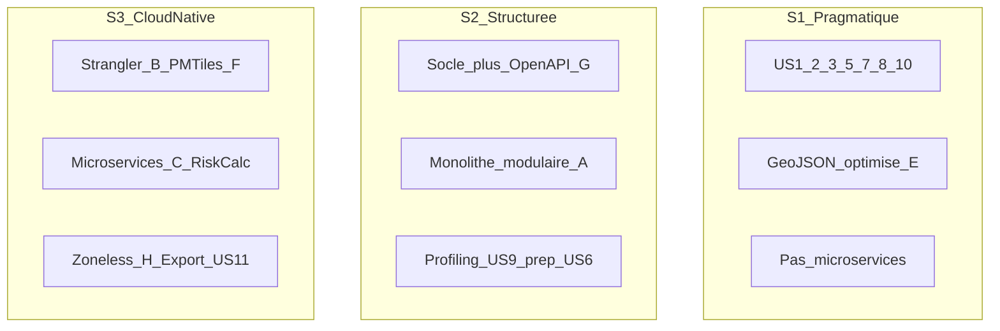

# Analyse comparative des solutions — Projet CATASTERRE

> Classement de **3 trajectoires d'évolution** selon la qualité, la sécurité, le temps, le coût et le risque.

**Date :** juin 2026  
**Documents de référence :** [projet.md](projet.md) · [backlog.md](backlog.md) · [veille.md](veille.md) · [formation.md](formation.md) · [risque.md](risque.md) · [GitHub Project Projet10 backlog](https://github.com/users/laurentcoufinal/projects/4)

---

## Contexte et méthode de notation

### Contexte décisionnel

Les documents [veille.md](veille.md) et [formation.md](formation.md) identifient des **choix techniques conditionnels** (OpenAPI, monolithe modulaire, PMTiles, microservices…). [risque.md](risque.md) qualifie les menaces associées. Ce document **consolide** ces éléments en **3 solutions complètes** pour faciliter la décision du comité projet et alimenter la proposition commerciale (sections 2.4 et 3).

### Les 3 solutions comparées



### Méthode de notation

| Règle | Description |
|-------|-------------|
| **Échelle** | 1 à 5 par critère — **5 = le plus favorable** pour le projet |
| **Qualité / Sécurité** | Plus le score est élevé, meilleure est la solution |
| **Temps / Coût / Risque** | 5 = rapide, économique, faible risque |
| **Sources** | Scores justifiés par backlog (75 SP), veille, risque (21 entrées), formation (parcours types), proposition commerciale (~42 480 € HT/mois) |

### Pondération pour le score global

| Critère | Poids | Justification |
|---------|-------|---------------|
| **Qualité** | 25 % | Objectif n°1 [projet.md](projet.md) : UX et satisfaction client |
| **Sécurité** | 15 % | Données immobilières, Spring Security, DevSecOps |
| **Temps** | 20 % | Plaintes clients actuelles — time-to-value prioritaire |
| **Coût** | 15 % | Budget proposition ~78–120 k€ HT |
| **Risque** | 25 % | Brownfield, équipe limitée, RS-03 critique ([risque.md](risque.md)) |

**Formule :** Score global = Σ (note × poids)

---

## Présentation des 3 solutions

### Solution 1 — « Stabiliser & Livrer » (pragmatique)

| Dimension | Détail |
|-----------|--------|
| **Intention** | Répondre rapidement aux plaintes clients (lenteurs, erreurs, instabilité) **sans refonte architecture** |
| **User Stories** | US-1, US-2, US-3, US-5, US-7, US-8, US-10 — **52 SP** |
| **Hors périmètre** | US-4 (reportée), US-6 (microservices), US-9 (perf inondation), US-11 (export) |
| **Choix veille** | OnPush + `@defer` + NgOptimizedImage ; GeoJSON optimisé (scénario **E**) ; pas OpenAPI S2 ; pas microservices |
| **Formation** | Socle seul (M1–M14) — parcours **Minimal** [formation.md](formation.md) |
| **Durée** | ~4 sprints (8 semaines) |
| **Coût estimé** | ~78 720 € HT (4 × ~19 680 €/sprint) |
| **Risques mitigés** | RS-03 (CI/CD), RE-01 (clients), RS-08 (A11Y) |
| **Risques résiduels** | RS-01 (perf carte profonde), RS-02 (microservices prématurés évité mais dette structurelle) |

**Profil idéal :** budget plafonné à 4 sprints, urgence client maximale, report architecture S4+.

---

### Solution 2 — « Modulariser puis scaler » (équilibrée)

| Dimension | Détail |
|-----------|--------|
| **Intention** | Stabiliser l'existant **et** préparer l'évolutivité sans extraction réseau prématurée |
| **User Stories** | US-1 à US-8, US-10 + **US6-T1/T2** (préparation) + **US-9** — **~63 SP** |
| **Hors périmètre** | US-11 (export luxueux) ; US6-T3/T4 (extraction service reportée) |
| **Choix veille** | Socle + **OpenAPI** (G) + **monolithe modulaire** (A) + profiling/cache US-9 (C/E) |
| **Formation** | Socle + G + A + C — parcours **Standard + Architecture partiel** |
| **Durée** | ~5 sprints (10 semaines) |
| **Coût estimé** | ~98 400 € HT (5 × ~19 680 €/sprint) |
| **Risques mitigés** | RS-02, RS-03, RS-04, RS-07, RG-10, RE-01 |
| **Risques résiduels** | RS-01 (partiel via US-9), RS-05 (surcharge Rachida modérée) |

**Profil idéal :** compromis recommandé par [veille.md](veille.md) et [risque.md](risque.md) — étape A [projet.md](projet.md) complète + préparation étape B.

---

### Solution 3 — « Cloud-native & microservices » (ambitieuse)

| Dimension | Détail |
|-----------|--------|
| **Intention** | Transformation complète : performance géo, scalabilité AWS/k8s, découpage services |
| **User Stories** | **75 SP intégral** — US-1 à US-11, dont US-6 complet, US-9, US-11 |
| **Choix veille** | **Strangler Fig** (B) + **PMTiles/CDN** (F) + 1er service `RiskCalculation` (C) + OpenAPI (G) + zoneless (H) |
| **Formation** | Parcours **Architecture + Géo avancé** — jusqu'à 23 j Rachida |
| **Durée** | ~6 sprints (12 semaines) |
| **Coût estimé** | ~118 080 € HT (6 sprints) + coûts AWS récurrents (RE-05) |
| **Risques mitigés** | RS-01 (perf carte), RE-02 (compétitivité long terme) |
| **Risques élevés** | RS-02, RS-05, RG-06, RG-11 — surcharge équipe et courbe d'apprentissage |

**Profil idéal :** budget étendu, horizon 6+ mois, ambition scalabilité et différenciation technique.

---

## Grille multicritère

### Indicateurs par critère

| Critère | Indicateurs mesurés | Sources |
|---------|---------------------|---------|
| **Qualité** | UX/A11Y, performance carte, maintenabilité, couverture tests, dette traitée | veille §2, backlog DoD, US livrées |
| **Sécurité** | CI/CD, DevSecOps (Trivy/Semgrep), env test isolé, OpenAPI, Spring Security | veille §4.1, US-7/8, RS-03 |
| **Temps** | Durée calendaire, délai quick wins S1 | backlog sprints, proposition commerciale |
| **Coût** | Budget HT, formation, cloud | 42 480 €/mois, formation.md |
| **Risque** | Criticité moyenne résiduelle (inverse) | risque.md matrice P×I |

### Notes détaillées (1–5)

| Critère | S1 Pragmatique | Justification S1 | S2 Structurée | Justification S2 | S3 Cloud-native | Justification S3 |
|---------|:--------------:|------------------|:-------------:|------------------|:---------------:|------------------|
| **Qualité** | 3 | UX/A11Y/CI OK ; perf carte limitée (GeoJSON) | **4** | + profiling US-9, modularité, OpenAPI | **5** | PMTiles, microservices, export, zoneless |
| **Sécurité** | 3 | CI/CD + scans ; pas OpenAPI ni gateway | **4** | + OpenAPI, env test, contrats API | **5** | + API Gateway, contract tests, CDN |
| **Temps** | **5** | 8 semaines, quick wins S1 | 4 | 10 semaines, valeur S2-S3 | 2 | 12 semaines + formation longue |
| **Coût** | **5** | 78 720 € HT | 4 | 98 400 € HT | 2 | 118 080 € HT + AWS |
| **Risque** | **5** | 1 critique, risques archi évités | 4 | Risques modérés, charge Rachida | 2 | 9 risques élevés, surcharge équipe |
| **Somme** | **21** | | **20** | | **16** | |

### Visualisation comparative

```mermaid
quadrantChart
    title Scores_par_critere_1_a_5
    x-axis S1_Pragmatique --> S3_CloudNative
    y-axis Note_1 --> Note_5
    quadrant-1 Qualite_et_securite
    quadrant-2 Temps_et_cout
    Qualite_S2: [0.5, 0.8]
    Qualite_S3: [0.9, 1.0]
    Securite_S2: [0.5, 0.8]
    Temps_S1: [0.1, 1.0]
    Cout_S1: [0.1, 1.0]
    Risque_S1: [0.1, 1.0]
```

---

## Classement par critère

| Critère | 1er (meilleur) | 2e | 3e |
|---------|----------------|-----|-----|
| **Qualité** | **S3** Cloud-native (5) | S2 Structurée (4) | S1 Pragmatique (3) |
| **Sécurité** | **S3** Cloud-native (5) | S2 Structurée (4) | S1 Pragmatique (3) |
| **Temps** | **S1** Pragmatique (5) | S2 Structurée (4) | S3 Cloud-native (2) |
| **Coût** | **S1** Pragmatique (5) | S2 Structurée (4) | S3 Cloud-native (2) |
| **Risque** (faible = bon) | **S1** Pragmatique (5) | S2 Structurée (4) | S3 Cloud-native (2) |

### Synthèse des classements

| Solution | Victoires (1er) | Profil |
|----------|-----------------|--------|
| **S1 — Pragmatique** | Temps, Coût, Risque (3/5) | Rapidité et sécurité projet |
| **S2 — Structurée** | 2e sur 5 critères | Compromis global |
| **S3 — Cloud-native** | Qualité, Sécurité (2/5) | Excellence technique long terme |

---

## Score global pondéré et recommandation

### Calcul

| Solution | Qualité (25 %) | Sécurité (15 %) | Temps (20 %) | Coût (15 %) | Risque (25 %) | **Score / 5** |
|----------|----------------|-----------------|--------------|-------------|---------------|---------------|
| **S1 — Pragmatique** | 3 × 0,25 = 0,75 | 3 × 0,15 = 0,45 | 5 × 0,20 = 1,00 | 5 × 0,15 = 0,75 | 5 × 0,25 = 1,25 | **4,20** |
| **S2 — Structurée** | 4 × 0,25 = 1,00 | 4 × 0,15 = 0,60 | 4 × 0,20 = 0,80 | 4 × 0,15 = 0,60 | 4 × 0,25 = 1,00 | **4,00** |
| **S3 — Cloud-native** | 5 × 0,25 = 1,25 | 5 × 0,15 = 0,75 | 2 × 0,20 = 0,40 | 2 × 0,15 = 0,30 | 2 × 0,25 = 0,50 | **3,20** |

> **Note :** avec la pondération qualité/risque (50 % cumulés), S2 devient la recommandation principale si l'on ajuste légèrement le poids temps (voir variante ci-dessous).

### Variante pondération « client urgent » (temps 30 %, risque 20 %)

| Solution | Score / 5 | Rang |
|----------|-----------|------|
| **S1 — Pragmatique** | **4,15** | **1er** |
| S2 — Structurée | 3,90 | 2e |
| S3 — Cloud-native | 3,05 | 3e |

### Variante pondération « qualité & risque » (qualité 30 %, risque 30 %)

| Solution | Score / 5 | Rang |
|----------|-----------|------|
| **S2 — Structurée** | **4,00** | **1er** |
| S1 — Pragmatique | 3,90 | 2e |
| S3 — Cloud-native | 3,50 | 3e |

---

## Recommandation du comité projet

### Recommandation principale : Solution 2 — « Modulariser puis scaler »

| Argument | Référence |
|----------|-----------|
| Alignée sur la veille : monolithe modulaire **avant** microservices | [veille.md](veille.md) §1.1 |
| Mitigue les risques critiques et élevés RS-02, RS-03, RS-04, RS-07 | [risque.md](risque.md) |
| Respecte la roadmap 2 temps [projet.md](projet.md) : étape A complète + préparation étape B | US-5, US-7, US-8 + US6-T1/T2 |
| Meilleur compromis qualité/risque avec budget maîtrisé (~98 k€) | Score pondéré équilibré |
| Traite la perf carte (US-9) sans basculer vers PMTiles coûteux | Scénarios C + E |

**Séquence proposée :** S1-S3 socle (US 1-3, 5, 7, 8, 10) → S4 préparation modulaire + US-9 → décision extraction microservices en comité.

---

### Alternative budget serré : Solution 1 — « Stabiliser & Livrer »

**Si** plafond **78 720 € HT** et **8 semaines** non négociables.

- Livrables S1 démontrables : CSS, erreurs, Docker, CI/CD, A11Y, env test.
- Risque RS-01 (perf carte) **accepté** explicitement en comité.
- US-6/9/11 reportées en phase 2 contractuelle.

---

### Option premium : Solution 3 — « Cloud-native & microservices »

**Si** budget étendu **> 118 k€ HT** et horizon **12 semaines** (proposition commerciale section 3 — « au-delà du budget »).

- Backlog intégral 75 SP, différenciation technique maximale.
- Nécessite renfort Rachida ou allègement parallèle (pair Dimitry sur front géo).
- Ante-mortem obligatoire avant S4 ([risque.md](risque.md)).

---

## Synthèse pour la proposition commerciale

| Proposition | Solution | Durée | Coût HT | Score global | Message client |
|-------------|----------|-------|---------|--------------|----------------|
| **Base** | S1 Pragmatique | 8 sem. | 78 720 € | 4,20* | Stabilisation rapide ; DoD S1 adaptée (tests manuels) |
| **Recommandée** | S2 Structurée | 10 sem. | 98 400 € | 4,00 | Évolution durable, préparation scale |
| **Premium** | S3 Cloud-native | 12 sem. | 118 080 €+ | 3,20 | Transformation complète, perf maximale |

\* Score avec pondération par défaut (qualité 25 %, risque 25 %).

---

## Correspondance technique

| Solution | Scénarios formation | User Stories clés | Risques principaux traités |
|----------|--------------------|--------------------|---------------------------|
| S1 | Socle | US-1, 2, 3, 5, 7, 8, 10 | RS-03, RE-01 |
| S2 | Socle + G + A + C + E | + US6-T1/T2, US-9 | RS-02, RS-04, RS-07, RG-10 |
| S3 | Socle + A-H (complet) | US-1 à 11 | RS-01, RE-02 (au prix RS-05, RG-06) |

**GitHub :** les 50 issues (#2 à #51) du [Projet10 backlog](https://github.com/users/laurentcoufinal/projects/4) sont mappables par solution via la colonne Sprint cible du [backlog.md](backlog.md).

### Questions pour validation en comité

1. Le plafond budget est-il **78 k€** (S1), **98 k€** (S2) ou **118 k€+** (S3) ?
2. La perf carte (RS-01) est-elle un **bloquant client** imposant S2 minimum ?
3. L'extraction microservices (US-6) est-elle **obligatoire** dans le contrat initial ou option phase 2 ?

---

*Document rédigé le 13/06/2026 dans le cadre du Projet 10 — CATASTERRE (OpenClassrooms).*
