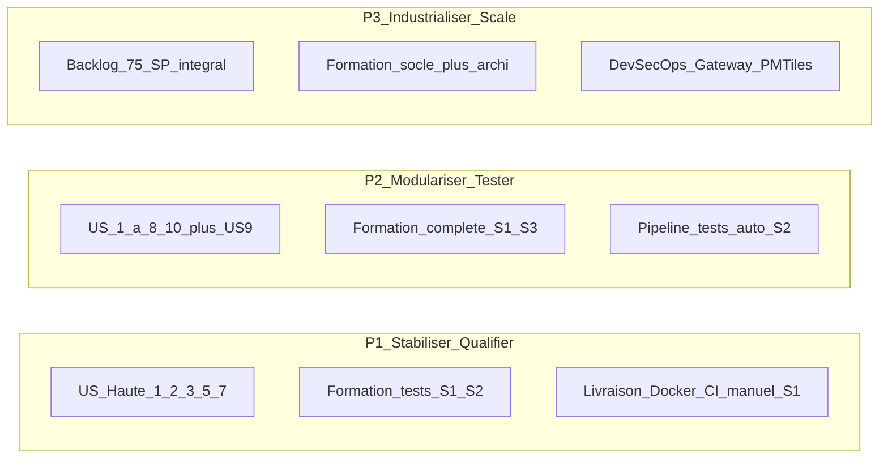

# Comparaison de 3 propositions — Projet CATASTERRE

> Analyse multicritère de **3 trajectoires d'évolution** intégrant la **formation tests obligatoire** (blocage Daily Scrum Rachida).

**Date :** juin 2026  
**Documents de référence :** [choix.md](choix.md) · [backlog.md](backlog.md) · [formation.md](formation.md) · [comite-projet.md](comite-projet.md) · [risque.md](risque.md) · [veille.md](veille.md) · [projet.md](projet.md) · [GitHub Project Projet10 backlog](https://github.com/users/laurentcoufinal/projects/7)

---

## Contexte décisionnel

### Évolution par rapport à [choix.md](choix.md)

[choix.md](choix.md) compare déjà 3 trajectoires (Pragmatique / Structurée / Cloud-native) sur 5 critères. Ce document **affine** l'analyse avec :

| Dimension ajoutée ou renforcée | Source |
|--------------------------------|--------|
| **Sécurité applicative** (distincte de la livraison) | Spring Security, données immobilières, OpenAPI, scans DevSecOps — [veille.md](veille.md) §4.1, RS-04 |
| **Sécurité de livraison** | Docker, CI/CD, env test isolé, tests en pipeline, conventions Git, PROC-T2 — US-5/7/8, **RS-03 critique** |
| **Priorité des User Stories** | Regroupement [backlog.md](backlog.md) : Haute, Moyenne, Basse, Luxueuse |
| **Formation tests obligatoire** | Blocage Rachida — [comite-projet.md](comite-projet.md), RS-11, modules FORM-T0 à T-JO1 |

**Contrainte non négociable :** les 3 propositions intègrent **systématiquement** le plan formation tests. Ce n'est plus une option réservée à la solution structurée ou premium.

### Point bloquant — pourquoi la formation tests est obligatoire

> « Nous ne pouvons pas développer et tester en même temps. […] Le reste de notre équipe n'a pas les compétences nécessaires pour écrire et implémenter des tests. » — Rachida, Daily Scrum

| Impact | Référence |
|--------|-----------|
| DoD standard inapplicable en S1 | [comite-projet.md](comite-projet.md) §3 |
| US7-T2 (tests en pipeline) bloquée sans TEST-T1/T2 | [backlog.md](backlog.md) Sprint 2 |
| Risque RS-11 (lacune compétences tests) | [risque.md](risque.md) — Criticité **Élevée** (16) |
| Vélocité S1 ajustée à **12 SP** | Tests auto reportés S2 |

---

## Méthode de notation

### Échelle et formule

| Règle | Description |
|-------|-------------|
| **Échelle** | 1 à 5 par critère — **5 = le plus favorable** pour le projet |
| **Qualité / Sécurités / Priorité US** | Plus le score est élevé, meilleure est la solution |
| **Temps / Coût / Risque** | 5 = rapide, économique, faible risque |
| **Formule** | Score global = Σ (note × poids), résultat sur **5** |

### Pondération des 7 critères

| Critère | Poids | Justification |
|---------|-------|---------------|
| **Qualité** | 20 % | UX, A11Y, maintenabilité, couverture tests post-formation |
| **Sécurité applicative** | 10 % | Données immobilières sensibles, Spring Security, contrats API |
| **Sécurité de livraison** | 15 % | RS-03 critique ; formation tests = prérequis livraison fiable |
| **Coût** | 15 % | Budget 78–118 k€ HT ([proposition commerciale](Modèle+-+Proposition+Commerciale+-+DFSJA+P8+=+AL+P10.txt)) |
| **Temps** | 15 % | Plaintes clients actuelles — time-to-value prioritaire |
| **Risque** | 15 % | Brownfield, RS-11, surcharge équipe (RG-06) |
| **Priorité US** | 10 % | Alignement backlog Notion — US Haute d'abord |

### Sources chiffrées

| Indicateur | Valeur |
|------------|--------|
| Backlog total | 75 SP (11 US + procédures + tests + formation) |
| Coût mensuel équipe | 42 480 € HT (4 profils × 18 j/mois) |
| Coût sprint moyen | ~19 680 € HT |
| Vélocité S1 (ajustée) | 12 SP dev + hors SP (formation, PROC-T2) |
| Vélocité S2 (engagement) | 12 SP dev confirmés + marge 2 SP (cible 14 SP) |

---

## Exigence transverse : formation tests obligatoire

### Principe

- Formation **hors SP** (label GitHub `formation`, `sp:0`) — n'impacte pas la vélocité mesurée (12 / 14 SP).
- **Bloque** néanmoins US7-T2 et la DoD standard tant que les modules S2 ne sont pas certifiés.
- L'Expert **facilite** (T-EX1) ; il n'est plus le seul rédacteur de tests.

### Modules et charge

| Module | Profil | Durée | Sprint | Critère « Certified » |
|--------|--------|-------|--------|----------------------|
| **FORM-T0** | Dimitry + Rachida | 2 h | S1 | Compte-rendu atelier |
| **T-EX1** | Expert | 0,5 j | S1-S2 | Document stratégie tests partagé |
| **T-DI1** | Dimitry | 1 j | S2 | 3 tests Angular passants (TEST-T1) |
| **T-RA1** | Rachida | 1 j | S2 | 3 tests JUnit passants (TEST-T2) |
| **T-RA2** | Rachida | 0,5 j | S2 | Tests intégration Testcontainers en CI |
| **T-ALL1** | Dimitry + Rachida | 0,5 j | S2 | 1 feature en TDD validée en pair |
| **T-DI2** | Dimitry | 1 j | S2-S3 | 1 scénario Cypress vert |
| **T-JO1** | Jorge + Dimitry | 0,5 j | S2 | Scénarios E2E documentés |

| Profil | Charge cumulée formation tests |
|--------|-------------------------------|
| Dimitry | 2,5 j (S2-S3) |
| Rachida | 1,5 j (dont 1 j formateur) |
| Expert | 0,5 j (stratégie) |
| Jorge | 0,5 j (scénarios métier) |

### DoD par sprint (toutes propositions)

| Sprint | Definition of Done |
|--------|-------------------|
| **S1** | Tests **manuels documentés** (PROC-T2) — exception validée en comité |
| **S2+** | Tests automatisés obligatoires (unitaires + intégration selon US) |
| **S3+** | Tests E2E Cypress sur parcours critiques (TEST-T3) |

### Différenciation formation par proposition

| Module / tâche | P1 | P2 | P3 |
|----------------|:--:|:--:|:--:|
| FORM-T0, T-EX1, PROC-T2 | oui | oui | oui |
| T-DI1, T-RA1, T-ALL1, TEST-T1/T2 | oui | oui | oui |
| T-DI2, T-RA2, T-JO1, TEST-T3 | partiel S3 | oui | oui |
| TDD systématique sur nouvelles US | non | oui | oui |
| Formation architecture (A–H) | non | partiel (G, A, C) | complet |

---

## Les 3 propositions

---

### Proposition 1 — « Stabiliser & qualifier » (budget serré)

| Dimension | Détail |
|-----------|--------|
| **Intention** | Quick wins client + montée en compétence tests **minimale viable** avant industrialisation |
| **User Stories** | **Haute uniquement** : US-1, US-2, US-3, US-5, US-7 (partiel — US7-T2/T3 reportés S4) |
| **SP dev** | ~52 SP |
| **Hors périmètre** | US-4 (Basse), US-6/8/9/10/11 (Moyenne/Luxueuse reportées) |
| **Formation tests** | FORM-T0, T-EX1 (S1) · T-DI1, T-RA1, T-ALL1 (S2) · TEST-T1/T2 · PROC-T2 S1 |
| **Sécurité applicative** | Corrections erreurs (US-2), A11Y (US-3) — pas OpenAPI ni env test dédié |
| **Sécurité de livraison** | Docker (US-5) + CI build (US7-T1) + tests manuels PROC-T2 · **US7-T2/T3 et US-8 reportés** |
| **Choix veille** | OnPush + `@defer` + NgOptimizedImage ; GeoJSON optimisé (E) ; pas microservices |
| **Durée** | ~4 sprints (8 semaines) |
| **Coût estimé** | **78 720 € HT** |
| **Risques mitigés** | RS-11 (formation S2), RE-01 (clients), RS-08 (A11Y) |
| **Risques résiduels** | RS-03 partiel (pipeline sans tests auto), RS-01 (perf carte) |

**Profil idéal :** plafond **78 720 € HT** et **8 semaines** non négociables ; acceptation explicite du report env test et tests pipeline.

**Séquence sprints :**

| Sprint | Focus | SP dev |
|--------|-------|--------|
| S1 | US-1, US-2, US-5 + FORM-T0, PROC-T2 | 12 |
| S2 | US-3 (partiel), US-7-T1, formation + TEST-T1/T2 | 12 (+ marge 2) |
| S3 | Finalisation US-3, US-7-T1, rattrapage tests | ~14 |
| S4 | US7-T2/T3 (si formation certifiée) | ~14 |

---

### Proposition 2 — « Modulariser, tester & livrer » (recommandée)

| Dimension | Détail |
|-----------|--------|
| **Intention** | Couvrir US **Haute + Moyenne** avec **DoD standard dès S2** (tests automatisés) |
| **User Stories** | US-1 à US-8, US-10 + préparation US-9 (US6-T1/T2) |
| **SP dev** | ~63 SP |
| **Hors périmètre** | US-11 (Luxueuse) ; extraction microservices US6-T3/T4 reportée |
| **Formation tests** | Parcours complet FORM-T0 → T-JO1 · TEST-T1/T2/T3 · TDD (T-ALL1) · 0,5 j/sprint capacité formation S2 |
| **Sécurité applicative** | OpenAPI (G), monolithe modulaire (A), scans CI (Trivy/Semgrep), Spring Security renforcé |
| **Sécurité de livraison** | US-5 + US-7 complet (US7-T2 lint + tests) + US-8 env test · PROC-T1/T2 |
| **Choix veille** | Socle + OpenAPI (G) + monolithe modulaire (A) + profiling/cache US-9 (C/E) |
| **Durée** | ~5 sprints (10 semaines) |
| **Coût estimé** | **98 400 € HT** |
| **Risques mitigés** | RS-03, RS-11, RS-04, RS-07, RG-10, RE-01 |
| **Risques résiduels** | RS-01 (partiel via US-9), RS-05 (surcharge Rachida modérée) |

**Profil idéal :** compromis recommandé — étape A [projet.md](projet.md) complète + préparation étape B, avec livraison industrielle crédible.

**Séquence sprints :**

| Sprint | Focus | SP dev |
|--------|-------|--------|
| S1 | US-1, US-2, US-5 + FORM-T0, PROC-T2 | 12 |
| S2 | US-3 (début), US-7-T1, formation, TEST-T1/T2 | 12 (+ marge 2) |
| S3 | US-3 (fin), US-7-T2/T3, US-8, TEST-T3 | ~16 |
| S4 | US-6-T1/T2, US-9 (début), US-10 | ~18 |
| S5 | US-9 (fin), stabilisation, décision microservices | ~15 |

---

### Proposition 3 — « Industrialiser & scaler » (premium)

| Dimension | Détail |
|-----------|--------|
| **Intention** | Backlog intégral 75 SP + excellence livraison et performance géographique |
| **User Stories** | **Toutes** US-1 à US-11, dont US-6 complet, US-9, US-11 |
| **SP dev** | 75 SP |
| **Hors périmètre** | Aucun — périmètre contractuel maximal |
| **Formation tests** | Formation tests complète + parcours Architecture (A–H) — jusqu'à 23 j Rachida cumulées |
| **Sécurité applicative** | API Gateway, PMTiles/CDN (F), microservices RiskCalculation (C), zoneless (H) |
| **Sécurité de livraison** | CI/CD multi-env, registry Docker, contract tests, Testcontainers en CI (T-RA2) |
| **Choix veille** | Strangler Fig (B) + PMTiles (F) + 1er service (C) + OpenAPI (G) + zoneless (H) |
| **Durée** | ~6 sprints (12 semaines) |
| **Coût estimé** | **118 080 € HT** + coûts AWS récurrents (RE-05) |
| **Risques mitigés** | RS-01 (perf carte), RE-02 (compétitivité long terme) |
| **Risques élevés** | RS-02, RS-05, RG-06, RG-11 — surcharge équipe et courbe d'apprentissage |

**Profil idéal :** budget étendu **> 118 k€ HT**, horizon **12 semaines**, ambition scalabilité et différenciation technique.

**Séquence sprints :**

| Sprint | Focus | SP dev |
|--------|-------|--------|
| S1-S2 | Socle + formation tests (identique P2) | 12 + 12 |
| S3-S4 | US-6 extraction, US-8, US-9, US-10 | ~18 + ~18 |
| S5-S6 | US-11, PMTiles, gateway, finalisation | ~20 + ~15 |

---

## Matrice priorité User Stories

Alignement sur le regroupement [backlog.md](backlog.md) :

| Priorité | User Stories | SP total | P1 | P2 | P3 |
|----------|--------------|----------|:--:|:--:|:--:|
| **Haute** | US-1, US-2, US-3, US-5, US-7 | 31 | 100 % | 100 % | 100 % |
| **Moyenne** | US-6, US-8, US-10 | 26 | 0 % | 100 % | 100 % |
| **Basse** | US-4 | 5 | 0 % | 0 % | 100 % |
| **Luxueuse** | US-9, US-11 | 13 | 0 % | partiel (US-9) | 100 % |

### Détail couverture par US

| US | Titre | Priorité | SP | P1 | P2 | P3 |
|----|-------|----------|-----|:--:|:--:|:--:|
| US-1 | Style CSS | Haute | 5 | oui | oui | oui |
| US-2 | Messages d'erreur | Haute | 5 | oui | oui | oui |
| US-3 | Accessibilité (A11Y) | Haute | 8 | oui | oui | oui |
| US-4 | Nouveau thème | Basse | 5 | — | — | oui |
| US-5 | Encapsuler (Docker) | Haute | 5 | oui | oui | oui |
| US-6 | Micro-services | Moyenne | 13 | — | prép. (T1/T2) | oui |
| US-7 | CI/CD | Haute | 8 | partiel | oui | oui |
| US-8 | Env. de test | Moyenne | 8 | — | oui | oui |
| US-9 | Risque inondation | Luxueuse | 8 | — | partiel | oui |
| US-10 | Compatibilité navigateurs | Moyenne | 5 | — | oui | oui |
| US-11 | Export données | Luxueuse | 5 | — | — | oui |

---

## Grille multicritère

### Indicateurs par critère

| Critère | Indicateurs mesurés | Sources |
|---------|---------------------|---------|
| **Qualité** | UX/A11Y, performance carte, maintenabilité, couverture tests, dette traitée | veille §2, backlog DoD, US livrées |
| **Sécurité applicative** | Spring Security, OpenAPI, scans, gateway, données sensibles | veille §4.1, RS-04 |
| **Sécurité de livraison** | CI/CD, tests en pipeline, Docker, env test, PROC-T2, formation tests | US-5/7/8, RS-03, RS-11 |
| **Coût** | Budget HT, formation, cloud | proposition commerciale, formation.md |
| **Temps** | Durée calendaire, délai quick wins S1 | backlog sprints |
| **Risque** | Criticité moyenne résiduelle (inverse) | risque.md matrice P×I |
| **Priorité US** | % US Haute/Moyenne couvertes dans le contrat | backlog.md L250–269 |

### Notes détaillées (1–5)

| Critère | P1 | Justification P1 | P2 | Justification P2 | P3 | Justification P3 |
|---------|:--:|------------------|:--:|------------------|:--:|------------------|
| **Qualité** | 3 | UX/A11Y/CI OK ; tests auto limités S2 ; perf carte faible | **4** | + profiling US-9, modularité, tests auto dès S2 | **5** | PMTiles, microservices, export, zoneless |
| **Sécu. applicative** | 3 | Erreurs + A11Y ; pas OpenAPI ni env test | **4** | + OpenAPI, scans CI, Spring Security | **5** | + API Gateway, contract tests, CDN |
| **Sécu. livraison** | 3 | Docker + CI build ; tests manuels S1 ; US7-T2/US-8 reportés | **5** | Pipeline complète + env test + formation certifiante | **5** | Multi-env, registry, Testcontainers CI |
| **Coût** | **5** | 78 720 € HT | 4 | 98 400 € HT | 2 | 118 080 € HT + AWS |
| **Temps** | **5** | 8 semaines | 4 | 10 semaines | 2 | 12 semaines + formation longue |
| **Risque** | **4** | Risques archi évités ; RS-03 partiel | **4** | Risques modérés, charge Rachida | 2 | 9 risques élevés, surcharge équipe |
| **Priorité US** | 4 | 100 % Haute ; 0 % Moyenne/Luxueuse | **5** | Haute + Moyenne + partiel Luxueuse | **5** | Backlog intégral |
| **Somme brute** | **27** | | **31** | | **26** | |

---

## Scores pondérés et classement

### Calcul principal (pondération 7 critères)

| Critère | Poids | P1 | P1 pond. | P2 | P2 pond. | P3 | P3 pond. |
|---------|-------|:--:|--------|:--:|--------|:--:|--------|
| Qualité | 20 % | 3 | 0,60 | 4 | 0,80 | 5 | 1,00 |
| Sécu. applicative | 10 % | 3 | 0,30 | 4 | 0,40 | 5 | 0,50 |
| Sécu. livraison | 15 % | 3 | 0,45 | 5 | 0,75 | 5 | 0,75 |
| Coût | 15 % | 5 | 0,75 | 4 | 0,60 | 2 | 0,30 |
| Temps | 15 % | 5 | 0,75 | 4 | 0,60 | 2 | 0,30 |
| Risque | 15 % | 4 | 0,60 | 4 | 0,60 | 2 | 0,30 |
| Priorité US | 10 % | 4 | 0,40 | 5 | 0,50 | 5 | 0,50 |
| **Score / 5** | | | **3,85** | | **4,25** | | **3,65** |

### Classement global

| Rang | Proposition | Score / 5 | Profil |
|------|-------------|-----------|--------|
| **1er** | **P2 — Modulariser, tester & livrer** | **4,25** | Meilleur équilibre qualité / livraison / priorité US |
| 2e | P1 — Stabiliser & qualifier | 3,85 | Rapidité et coût ; sécurité livraison partielle |
| 3e | P3 — Industrialiser & scaler | 3,65 | Excellence technique au prix du risque et du coût |

### Classement par critère

| Critère | 1er | 2e | 3e |
|---------|-----|-----|-----|
| **Qualité** | P3 (5) | P2 (4) | P1 (3) |
| **Sécurité applicative** | P3 (5) | P2 (4) | P1 (3) |
| **Sécurité de livraison** | P2 / P3 (5) | — | P1 (3) |
| **Coût** | P1 (5) | P2 (4) | P3 (2) |
| **Temps** | P1 (5) | P2 (4) | P3 (2) |
| **Risque** | P1 / P2 (4) | — | P3 (2) |
| **Priorité US** | P2 / P3 (5) | P1 (4) | — |

### Variantes de pondération

**Client urgent (temps 25 %, coût 20 %, risque 10 %) :**

| Proposition | Score / 5 | Rang |
|-------------|-----------|------|
| **P1** | **3,95** | **1er** |
| P2 | 3,90 | 2e |
| P3 | 3,35 | 3e |

**Qualité & livraison (qualité 25 %, sécu. livraison 20 %, risque 20 %) :**

| Proposition | Score / 5 | Rang |
|-------------|-----------|------|
| **P2** | **4,35** | **1er** |
| P3 | 3,80 | 2e |
| P1 | 3,55 | 3e |

---

## Recommandation du comité projet

### Recommandation principale : Proposition 2 — « Modulariser, tester & livrer »

| Argument | Référence |
|----------|-----------|
| Seule proposition couvrant **Haute + Moyenne** avec **sécurité de livraison complète** (US7-T2 + US-8) | RS-03, RS-11 |
| Formation tests **intégrée et certifiante** — DoD standard dès S2 | [formation.md](formation.md), [comite-projet.md](comite-projet.md) |
| Alignée sur la veille : monolithe modulaire **avant** microservices | [veille.md](veille.md) §1.1 |
| Meilleur score pondéré (4,25/5) sur les 7 critères | Grille ci-dessus |
| Budget maîtrisé (~98 k€) vs premium P3 | Proposition commerciale |

**Séquence proposée :** S1 socle + formation amorce → S2 tests auto + CI build → S3 pipeline complète + env test → S4 préparation modulaire + US-9 → décision extraction microservices en comité.

---

### Alternative budget serré : Proposition 1 — « Stabiliser & qualifier »

**Si** plafond **78 720 € HT** et **8 semaines** non négociables.

- Livrables démontrables : CSS, erreurs, Docker, A11Y, CI build.
- Formation tests **obligatoire** dès S1-S2 (pas optionnelle).
- **Risque RS-03 partiel** à accepter explicitement : pipeline sans tests automatisés jusqu'à S4.
- US-6/8/9/10/11 reportées en phase 2 contractuelle.

---

### Option premium : Proposition 3 — « Industrialiser & scaler »

**Si** budget étendu **> 118 k€ HT** et horizon **12 semaines**.

- Backlog intégral 75 SP, différenciation technique maximale.
- Formation tests + architecture complète (jusqu'à 23 j Rachida).
- Nécessite renfort Rachida ou allègement parallèle (pair Dimitry sur front géo).
- Ante-mortem obligatoire avant S4 ([risque.md](risque.md)).

---

## Synthèse pour la proposition commerciale

| Proposition | Durée | Coût HT | Score / 5 | Couverture US Haute | Formation tests | Message client |
|-------------|-------|---------|-----------|---------------------|-------------------|----------------|
| **P1 — Base** | 8 sem. | 78 720 € | 3,85 | 100 % | Obligatoire S1-S2 | Stabilisation rapide ; tests manuels S1 puis auto S2 |
| **P2 — Recommandée** | 10 sem. | 98 400 € | **4,25** | 100 % + Moyenne | Complète S1-S3 | Évolution durable, livraison industrielle |
| **P3 — Premium** | 12 sem. | 118 080 €+ | 3,65 | Intégral | Complète + archi | Transformation complète, perf maximale |

### Alignement sections proposition commerciale

| Section | Contenu alimenté par ce document |
|---------|----------------------------------|
| **2.4 Risques identifiés** | RS-03, RS-11, matrice P×I par proposition |
| **2.5 Objectifs de performance** | Couverture tests, vélocité 12/14 SP, critères livraison |
| **3 Synthèse** | Tableau comparatif 3 propositions + recommandation P2 |

---

## Correspondance technique et GitHub

| Proposition | Scénarios formation | Issues GitHub clés | Risques principaux traités |
|-------------|----------------------|--------------------|---------------------------|
| P1 | FORM-T0 → T-ALL1, TEST-T1/T2 | US-1/2/3/5/7, PROC-T2, #52–#64 | RS-11, RE-01, RS-08 |
| P2 | + T-DI2, T-RA2, T-JO1, TEST-T3 | + US-6-T1/T2, US-8, US-9, US-10 | RS-03, RS-04, RS-07, RG-10 |
| P3 | + parcours A–H complet | Backlog 63 issues intégral | RS-01, RE-02 (au prix RS-05, RG-06) |

**GitHub :** les [63 issues](https://github.com/laurentcoufinal/projet10/issues) (#2–#64) du [Projet10 backlog](https://github.com/users/laurentcoufinal/projects/7) sont filtrables par proposition via labels `sprint:N`, `formation`, `sp:N`.

---

## Questions pour validation en comité

1. Le plafond budget est-il **78 k€** (P1), **98 k€** (P2) ou **118 k€+** (P3) ?
2. La **sécurité de livraison** (tests en pipeline + env test) est-elle un bloquant imposant **P2 minimum** ?
3. La formation tests est-elle **validée comme hors SP** mais **obligatoire** dans les 3 scénarios ?
4. L'extraction microservices (US-6) est-elle **obligatoire** dans le contrat initial ou option phase 2 ?
5. La perf carte (RS-01) est-elle un **bloquant client** imposant au minimum la préparation US-9 (P2) ?

---

*Document rédigé le 14/06/2026 — Projet 10 CATASTERRE (OpenClassrooms). Complète [choix.md](choix.md) avec 7 critères et formation tests obligatoire.*
