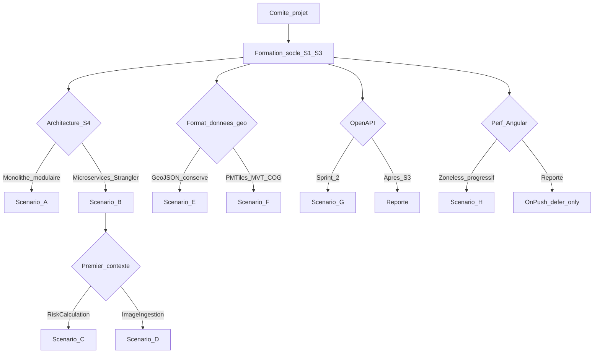

# Plans de formation — Projet CATASTERRE

> Parcours de montée en compétence **modulaires et conditionnels**, alignés sur les profils de l'équipe, les tâches de [veille.md](veille.md) et les choix techniques du comité projet.

**Date :** juin 2026  
**Documents de référence :** [projet.md](projet.md) · [backlog.md](backlog.md) · [veille.md](veille.md) · [comite-projet.md](comite-projet.md) · [GitHub Project Projet10 backlog](https://github.com/users/laurentcoufinal/projects/4)

---

## Comment utiliser ce document

Ce document **ne prescrit pas** les choix techniques. Il prévoit des parcours du type : *« si le comité retient X, alors activer les modules Y et Z pour le profil concerné »*.

### Profils et niveau de départ

| Profil | Expérience | Compétences actuelles ([projet.md](projet.md)) | Axes de montée en compétence |
|--------|------------|-----------------------------------------------|------------------------------|
| **Dimitry** | 3 ans | Angular, RxJS, HTML/CSS/JS | Performance front, A11Y, tests CI, cartographie |
| **Rachida** | 5 ans | Java, Go, Docker, k8s, AWS, GitHub Actions | Spring Boot perf, DevSecOps, microservices, géo back |
| **Jorge** | 12 ans | Figma, Miro, UX design | Accessibilité opérationnelle, tests cross-browser |
| **Expert** | Pilotage agile | Coordination, backlog, qualité | Architecture brownfield, DDD, gouvernance technique |

### Méthode pédagogique

- **70 %** apprentissage en **pair programming** sur les tâches du backlog (USx-Ty)
- **30 %** auto-formation ciblée (documentation, labs, articles de la veille)
- Validation par **livrable démontrable** en Sprint Review (aligné sur la Definition of Done du [backlog.md](backlog.md))

### Arbre de décision

Les scénarios dérivent des questions ouvertes de [veille.md](veille.md) :

| ID | Choix technique | Déclencheur (veille) | Sprints cibles |
|----|-----------------|----------------------|----------------|
| **Socle** | Docker + CI/CD + UX/A11Y | US-5, US-7, US-1 à US-3 | S1-S3 |
| **A** | Monolithe modulaire avant extraction | veille §1.1 | S3-S4 (pré-US-6) |
| **B** | Strangler Fig + microservices | veille §1.2, US-6 | S4+ |
| **C** | 1er service = `RiskCalculation` | veille §1.2, US-9 | S4+ |
| **D** | 1er service = `ImageIngestion` | veille §1.2 | S4+ |
| **E** | Conserver GeoJSON (optimisations locales) | veille §2.3 | S4 (US-9) |
| **F** | Migration PMTiles/MVT/COG + CDN | veille §1.4, §2.3 | S4+ |
| **G** | OpenAPI contract-first dès S2 | veille §1.5, US-2/7 | S2-S3 |
| **H** | Angular zoneless progressif | veille §2.1 | S2-S4 |

---

## Formation tests — priorité bloquante (Daily Scrum)

> **Contexte :** Rachida a signalé en Daily Scrum que l'équipe ne peut pas développer et tester en même temps — l'Expert pilote le projet sans capacité pour écrire les tests ; Dimitry et Rachida n'ont pas encore les compétences pour implémenter des tests automatisés. Ce blocage empêche de valider la qualité de l'incrément. Voir [comite-projet.md](comite-projet.md).

### Objectifs de la formation tests

1. **Écrire et implémenter des tests** — autonomie Dimitry (front) et Rachida (back) ; l'Expert **facilite**, ne porte plus seul la charge.
2. **Maîtriser les outils** — JUnit 5, Mockito, Testcontainers (back) ; Jasmine/Vitest, Cypress (front).
3. **Adopter le TDD** — Red-Green-Refactor pour garantir l'évolution future de l'application.

### Modules formation tests

| Module | Profil | Contenu | Outils | Durée | Sprint | Prérequis |
|--------|--------|---------|--------|-------|--------|-----------|
| **FORM-T0** | Dimitry + Rachida | Aperçu pyramide de tests, outillage projet | — | 2 h | S1 (hors SP) | — |
| **T-EX1** | Expert | Stratégie tests équipe : qui écrit quoi, critères DoD, pas de rédaction solo | — | 0,5j | S1-S2 | — |
| **T-DI1** | Dimitry | Tests unitaires Angular : structure, mocks, assertions | Jasmine / Vitest | 1j | S2 | FORM-T0 |
| **T-DI2** | Dimitry | Tests E2E parcours critiques (recherche, carte, auth) | Cypress | 1j | S2-S3 | T-DI1 |
| **T-RA1** | Rachida → Dimitry | Tests unitaires Spring Boot : controllers, services, exceptions | JUnit 5 + Mockito | 1j | S2 | FORM-T0 |
| **T-RA2** | Rachida | Tests intégration avec base réelle en CI | Testcontainers | 0,5j | S2 | T-RA1 |
| **T-ALL1** | Dimitry + Rachida | TDD en pratique : Red-Green-Refactor sur une US | JUnit + Vitest | 0,5j | S2 | T-DI1, T-RA1 |
| **T-JO1** | Jorge + Dimitry | Scénarios E2E métier : jeux de données, parcours utilisateur | Cypress + Figma | 0,5j | S2 | T-DI2 |

### Critères de validation formation tests

| Module | Critère « Certified » |
|--------|----------------------|
| T-DI1 | 3 tests unitaires Angular écrits et passants sur US2-T2 (TEST-T1 Done) |
| T-RA1 | 3 tests JUnit passants sur mapping erreurs back (TEST-T2 Done) |
| T-DI2 | 1 scénario Cypress vert sur parcours recherche (TEST-T3 en cours) |
| T-ALL1 | 1 feature développée en TDD (test écrit avant code) lors d'un pair programming |
| T-EX1 | Document stratégie tests partagé ; Expert n'est plus seul rédacteur de tests |

### Charge formation tests par profil

| Profil | Durée cumulée | Période |
|--------|---------------|---------|
| Dimitry | 2,5j | S2-S3 |
| Rachida | 1,5j (dont 1j formateur) | S2 |
| Expert | 0,5j | S1-S2 |
| Jorge | 0,5j | S2 |

### Lien avec le backlog

| Tâche backlog | Module formation |
|---------------|------------------|
| TEST-T1 | T-DI1 |
| TEST-T2 | T-RA1, T-RA2 |
| TEST-T3 | T-DI2, T-JO1 |
| US7-T2 | T-DI1 + T-RA1 (tests exécutés en CI) |
| PROC-T2 (tests manuels S1) | T-JO1 (préparation scénarios) |

---

## Formation transversale — socle Sprint 1-3

Formation **toujours activée**, indépendante des forks architecture. Étalement sur 3 sprints (~6 semaines).

### Dimitry — modules M1 à M4 (~3 jours)

| Module | Objectif | Durée | Tâches backlog | Veille | Ressources |
|--------|----------|-------|----------------|--------|------------|
| **M1 — Perf Angular de base** | `ChangeDetectionStrategy.OnPush`, blocs `@defer`, `NgOptimizedImage`, audit Lighthouse | 1j | US-1, US-10 | §2.1 | [Angular defer](https://angular.dev/guide/defer) · [Zyra zoneless](https://www.zyraui.dev/blog/angular-v21-zoneless-guide-remove-zonejs-use-signals) |
| **M2 — Gestion erreurs front** | Composant notification unifié, intercepteurs HTTP, mapping codes | 0,5j | US-2, US2-T2/T3 | §4.2 | Pair avec Rachida sur mapping back |
| **M3 — Accessibilité implémentation** | WCAG AA : navigation clavier, focus visible, ARIA, contrastes | 1j | US-3, US3-T2/T3/T4 | §4.2 | S'appuyer sur audit Jorge (US3-T1) |
| **M4 — Tests front en CI** | Vitest ou Jasmine + Testing Library intégrés à la pipeline | 0,5j | US-7-T2, TEST-T1 | §4.2 | **Fusionné avec T-DI1** — priorité S2 |

**Critères de validation socle Dimitry :**
- M1 : rapport Lighthouse avant/après sur page carte
- M2 : composant erreur intégré sur 2+ pages (US2-T2 Done)
- M3 : parcours clavier complet sans piège de focus (US3-T2 Done)
- M4 : tests unitaires front exécutés en CI sans échec silencieux

---

### Rachida — modules M5 à M8 (~4 jours)

| Module | Objectif | Durée | Tâches backlog | Veille | Ressources |
|--------|----------|-------|----------------|--------|------------|
| **M5 — Docker multi-stage** | Dockerfiles front (build Angular + nginx) et back (Maven + JRE minimal), `docker-compose.yml` | 1j | US-5, US5-T1/T2/T3 | §4.1 | [DevOps.dev multi-stage](https://blog.devops.dev/optimizing-java-application-docker-images-with-multi-stage-builds-b50119828840) |
| **M6 — GitHub Actions Full-Stack** | Jobs parallèles front/back, quality gates, publication image registry | 1,5j | US-7, US7-T1/T2/T3 | §4.1 | [secspringterracloud](https://github.com/georgesfk/secspringterracloud) |
| **M7 — DevSecOps CI** | Trivy (scan images), Semgrep (SAST), gestion secrets GitHub | 0,5j | US-7-T2 | §4.1 | Doc Trivy · Doc Semgrep |
| **M8 — Environnements Spring** | Profils `application-test.yml`, variables d'env, déploiement auto vers env test, smoke tests | 1j | US-8, US8-T1/T2/T3/T4 | §4.1 | Pair avec Expert sur US8-T4 |

**Critères de validation socle Rachida :**
- M5 : `docker compose up` démarre l'application complète (US5-T3 Done)
- M6 : pipeline verte sur push et PR (US7-T1 Done)
- M7 : build échoue si vulnérabilité critique détectée (US7-T2 Done)
- M8 : env test isolé de prod, smoke tests passants (US8-T4 Done)

---

### Jorge — modules M9 à M11 (~2 jours)

| Module | Objectif | Durée | Tâches backlog | Veille |
|--------|----------|-------|----------------|--------|
| **M9 — Audit A11Y opérationnel** | Méthode d'audit des parcours critiques (recherche, résultats, navigation), rapport actionnable | 1j | US3-T1 | §4.2 |
| **M10 — Revue UX formalisée** | Checklist Figma, protocole de validation des corrections visuelles | 0,5j | US1-T4, US-1/2 | §4.2 |
| **M11 — Matrice navigateurs** | Versions cibles (Chrome, Firefox, Safari, Edge), protocole de tests cross-browser avec Dimitry | 0,5j | US10-T1 | §2.1 |

**Critères de validation socle Jorge :**
- M9 : rapport d'audit avec points bloquants classés par priorité (US3-T1 Done)
- M10 : validation formalisée des corrections CSS S1 (US1-T4 Done)
- M11 : matrice documentée avec versions minimales supportées (US10-T1 Done)

---

### Expert — modules M12 à M14 (~1,5 jour)

| Module | Objectif | Durée | Tâches backlog | Veille |
|--------|----------|-------|----------------|--------|
| **M12 — Dette technique TIME/MoSCoW** | Classifier les modules : Tolérer, Investir, Migrer, Éliminer ; prioriser dette vélocité vs structurelle | 0,5j | US-4/9/11 | §3 |
| **M13 — Facilitation refinements** | Transformer les questions ouvertes de la veille en décisions backlog actionnables | 0,5j | Toutes US | Toutes sections |
| **M14 — Cartographie erreurs** | Schéma des flux d'erreur front (HTTP, validation) et back (exceptions Spring) | 0,5j | US-2, US2-T1 | §4.2 |

**Critères de validation socle Expert :**
- M12 : cartographie dette partagée en comité projet (veille §3.2)
- M13 : au moins 3 questions veille tranchées en refinement
- M14 : schéma flux erreur validé par Dimitry et Rachida (US2-T1 Done)

---

## Modules par choix technique — scénarios A à H

Les modules ci-dessous s'activent **uniquement** si le comité projet retient le choix correspondant.

---

### Scénario A — Monolithe modulaire (pré-US-6)

**Condition :** le comité impose des modules internes (`images`, `risques`, `auth`, `export`) avant toute extraction réseau.

| Profil | Module | Contenu | Durée | Prérequis |
|--------|--------|---------|-------|-----------|
| Expert | **A-EX1 — DDD & bounded contexts** | Atelier identification domaines, rédaction document US6-T1 | 1j | M12 |
| Rachida | **A-RA1 — Modular monolith Spring** | Packages par contexte, APIs internes, dépendances unidirectionnelles | 2j | M5, M8 |
| Dimitry | **A-DI1 — Front modulaire Angular** | Feature modules, lazy routes par domaine métier | 1j | M1 |
| Tous | **A-ALL1 — Atelier cartographie** | Workshop croisé front/back sur les 4 bounded contexts (veille §1) | 0,5j | A-EX1 |

**Validation :** document d'analyse US6-T1 avec domaines identifiés et validés par l'équipe.

**Sources :** [knowledgelib.io — Monolith to Microservices](https://knowledgelib.io/software/migrations/monolith-to-microservices/2026) · [DEV Community — Migration patterns](https://dev.to/sepehr/from-monolith-to-modular-monolith-to-microservices-realistic-migration-patterns-36f2)

---

### Scénario B — Strangler Fig + microservices (US-6)

**Condition :** extraction réseau validée Sprint 4+.

| Profil | Module | Contenu | Durée | Prérequis |
|--------|--------|---------|-------|-----------|
| Expert + Rachida | **B-1 — Strangler Fig en pratique** | Phases shadow → canary → cutover, façade/proxy, routage progressif | 1j | A-RA1 (recommandé) |
| Rachida | **B-2 — API Gateway** | Spring Cloud Gateway ou Traefik : routage, circuit breaker, observabilité | 1,5j | M6, M8 |
| Rachida | **B-3 — Anti-Corruption Layer** | Couche de traduction modèle legacy → nouveau service | 1j | B-1 |
| Dimitry | **B-4 — Consommation multi-services** | Gestion erreurs distribuées, timeouts, états de chargement front | 0,5j | M2 |
| Expert | **B-5 — Contract tests** | Pact ou Spring Cloud Contract, intégration CI | 1j | G-EX1 (si scénario G actif) |

**Validation :** premier service déployable indépendamment avec tests passants (US6-T3 Done).

**Sources :** veille §1.2-1.3 · [microservices.io](https://microservices.io/refactoring/) · [Microsoft Strangler Fig](https://learn.microsoft.com/en-us/azure/architecture/patterns/strangler-fig)

---

### Scénario C — Premier service = `RiskCalculation` (US-9)

**Condition :** le comité choisit d'extraire le calcul des risques en premier bounded context.

| Profil | Module | Contenu | Durée | Prérequis |
|--------|--------|---------|-------|-----------|
| Rachida | **C-RA1 — JPA performance** | Audit N+1, `open-in-view=false`, JOIN FETCH, DTO projections, profiling US9-T1 | 1,5j | M8 |
| Rachida | **C-RA2 — Cache Caffeine/Redis** | Mise en cache des données de référence stables (pas listes dynamiques) | 1j | C-RA1 |
| Rachida | **C-RA3 — Virtual threads Java 21** *(optionnel)* | Configuration virtual threads + dimensionnement pool HikariCP | 0,5j | C-RA1 |
| Dimitry | **C-DI1 — Affichage zones côtières** | Optimisation rendu carte, zones inondables, UX fluide | 1j | M1 |
| Expert | **C-EX1 — Validation métier** | Jeu de 10 cas de test, conformité résultats (US9-T4) | 0,5j | C-RA1 |

**Validation :** temps de réponse réduit d'au moins 30 % sur jeu de test (US9-T2 Done).

**Sources :** [Devops Monk — JPA Performance](https://blog.devops-monk.com/2026/05/spring-boot-jpa-performance/) · [CodeWiz — JPA anti-patterns](https://codewiz.info/blog/jpa-performance-anti-patterns/)

---

### Scénario D — Premier service = `ImageIngestion`

**Condition :** le comité choisit d'extraire le traitement d'images satellite en premier.

| Profil | Module | Contenu | Durée | Prérequis |
|--------|--------|---------|-------|-----------|
| Rachida | **D-RA1 — Pipelines ingestion** | Batch processing, stockage, API dédiée, gestion erreurs | 1,5j | M5 |
| Rachida | **D-RA2 — Index spatial MySQL** | Index GIST/SPATIAL, requêtes géo optimisées | 1j | D-RA1 |
| Rachida | **D-RA3 — Catalogue STAC** *(optionnel)* | Métadonnées spatio-temporelles, catalogue images | 1j | D-RA1 |
| Dimitry | **D-DI1 — COG / tuiles raster** | Affichage optimisé imagerie via COG ou tuiles pré-générées | 1j | M1 |
| Expert | **D-EX1 — SLA ingestion** | Définition SLA débit/latence ingestion, monitoring | 0,5j | D-RA1 |

**Validation :** service ingestion déployable indépendamment (US6-T3 Done, variante images).

**Sources :** [BASF — STAC on EKS](https://noise.getoto.net/2025/10/22/basf-digital-farming-builds-a-stac-based-solution-on-amazon-eks/) · [Off-Nadir Delta — WebGIS](https://offnadir-delta.com/blog/webgis-architecture-modern-stack)

---

### Scénario E — GeoJSON conservé (optimisations locales)

**Condition :** le comité maintient le format GeoJSON et optimise localement.

| Profil | Module | Contenu | Durée | Prérequis |
|--------|--------|---------|-------|-----------|
| Dimitry | **E-DI1 — Optimisation rendu GeoJSON** | Simplification géométries, clustering, chargement progressif | 1j | M1 |
| Rachida | **E-RA1 — API pagination/filtrage** | Pagination, filtrage par bbox, compression gzip des réponses | 1j | M8 |
| Rachida | **E-RA2 — Index spatial MySQL** | Index sur colonnes géographiques, requêtes spatiales | 0,5j | E-RA1 |
| Jorge | **E-JO1 — UX chargement progressif** | États vide/chargement/erreur, feedback utilisateur pendant chargement | 0,5j | E-DI1 |

**Validation :** carte utilisable sans saturation navigateur sur zone de test représentative.

**Source :** [agfianf — 700K polygons](https://agfianf.github.io/blog/2025/03/04/optimizing-satellite-maps-efficiently-rendering-700k-object-polygons-and-their-attributes/)

---

### Scénario F — Migration PMTiles/MVT/COG + CDN

**Condition :** le comité valide une migration vers formats cloud-native et CDN.

| Profil | Module | Contenu | Durée | Prérequis |
|--------|--------|---------|-------|-----------|
| Dimitry | **F-DI1 — Tuiles vectorielles front** | MapLibre ou Leaflet + PMTiles/MVT, `@defer` sur composant carte | 1,5j | M1 |
| Rachida | **F-RA1 — Pipeline tuiles + CDN** | Génération tuiles, stockage S3, distribution CloudFront | 1,5j | M5, M8 |
| Rachida | **F-RA2 — COG HTTP range requests** | Servir imagerie raster en COG, streaming optimisé | 1j | F-RA1 |
| Jorge | **F-JO1 — UX latence tuiles** | Skeleton loaders, indicateurs de chargement tuiles, gestion erreur réseau | 0,5j | F-DI1 |

**Validation :** latence tuiles < 50 ms en conditions réseau normales (post-AWS).

**Sources :** veille §1.4 · [Off-Nadir Delta — CDN caching](https://offnadir-delta.com/blog/webgis-architecture-modern-stack)

---

### Scénario G — OpenAPI contract-first (Sprint 2)

**Condition :** le comité introduit OpenAPI dès le Sprint 2, en parallèle de la CI/CD.

| Profil | Module | Contenu | Durée | Prérequis |
|--------|--------|---------|-------|-----------|
| Rachida | **G-RA1 — SpringDoc / OpenAPI** | Approche spec-first, annotations, versioning API | 1j | M6 |
| Dimitry | **G-DI1 — Client TypeScript généré** | `openapi-generator`, intégration services Angular | 0,5j | G-RA1 |
| Expert | **G-EX1 — Gouvernance contrats** | Processus revue breaking changes en refinement | 0,5j | M13 |

**Validation :** spec OpenAPI publiée, client TypeScript généré et utilisé sur au moins 1 endpoint.

**Source :** veille §1.5 · [Innovirtuoso — Angular + Spring Boot](https://innovirtuoso.com/full-stack-development/complete-angular-spring-boot-developers-guide-build-scalable-full%e2%80%91stack-apps-that-ship-fast/)

---

### Scénario H — Angular zoneless progressif

**Condition :** le comité retient une migration zoneless (vs report OnPush/@defer seuls).

| Profil | Module | Contenu | Durée | Prérequis |
|--------|--------|---------|-------|-----------|
| Dimitry | **H-DI1 — Signals & zoneless** | Migration progressive, `provideExperimentalZonelessChangeDetection`, suppression Zone.js | 1,5j | M1 |
| Dimitry | **H-DI2 — Mesure Web Vitals** | Lighthouse CI, comparaison LCP/CLS/INP avant-après | 0,5j | H-DI1 |
| Jorge | **H-JO1 — Impact UX interactions** | Vérification INP sur parcours critiques post-migration | 0,5j | H-DI1 |

**Validation :** amélioration mesurable d'au moins 1 Core Web Vital sur page carte (rapport Lighthouse).

**Source :** [Zyra UI — Angular v21 Zoneless Guide](https://www.zyraui.dev/blog/angular-v21-zoneless-guide-remove-zonejs-use-signals)

---

## Synthèse — Matrice profil × scénario

Durées cumulées en jours (formation pure, hors développement backlog).

| Profil | Socle | A | B | C | D | E | F | G | H | **Total max** |
|--------|-------|---|---|---|---|---|---|---|---|---------------|
| **Dimitry** | 3j | +1j | +0,5j | +1j | +1j | +1j | +1,5j | +0,5j | +2j | **11,5j** |
| **Rachida** | 4j | +2j | +4j | +3j | +3,5j | +1,5j | +4j | +1j | — | **23j** |
| **Jorge** | 2j | +0,5j | — | — | — | +0,5j | +0,5j | — | +0,5j | **4j** |
| **Expert** | 1,5j | +1j | +2j | +0,5j | +0,5j | — | — | +0,5j | — | **6j** |

### Parcours types selon décisions comité

| Parcours | Scénarios actifs | Charge Dimitry | Charge Rachida | Période |
|----------|------------------|----------------|----------------|---------|
| **Minimal** (socle seul) | Socle | 3j | 4j | S1-S3 |
| **Standard** (+ OpenAPI + zoneless) | Socle + G + H | 6j | 5j | S1-S3 |
| **Architecture** (+ modular + microservices) | Socle + A + B + C | 5,5j | 13j | S1-S5 |
| **Géo avancé** (+ PMTiles/CDN) | Socle + F + C | 5,5j | 11j | S1-S5 |
| **Complet** (tous scénarios) | Socle + A-H | 11,5j | 23j | S1-S6 |

---

## Calendrier indicatif par sprint

| Période | Modules actifs (par défaut) | Décision comité requise |
|---------|----------------------------|-------------------------|
| **Sprint 1** | FORM-T0, T-EX1 · M1, M2 (Dimitry) · M5 (Rachida) · M10 (Jorge) · M12-M14 (Expert) | Point bloquant tests |
| **Sprint 2** | **T-DI1, T-RA1, T-ALL1, T-DI2** · M3, M6, M7 (Rachida) · M9 (Jorge) · **+ G** si OpenAPI | Formation tests prioritaire |
| **Sprint 3** | T-RA2, T-JO1 · M8 (Rachida) · fin socle · **+ H** si zoneless | — |
| **Pré-Sprint 4** | **A** (monolithe modulaire) si prérequis US-6 | Modules internes oui/non |
| **Sprint 4+** | **B** + (**C** ou **D**) + (**E** ou **F**) selon forks | Bounded context + format géo |

### Répartition hebdomadaire type (Sprint 1)

| Semaine | Dimitry | Rachida | Jorge | Expert |
|---------|---------|---------|-------|--------|
| S1-W1 | M1 (pair sur US1-T1/T2) | M5 (US5-T1/T2) | M10 (US1-T4) | M12, M14, T-EX1 |
| S1-W2 | M2 (US2-T2/T3) | M5 fin (US5-T3) | PROC-T2 tests manuels | M13, FORM-T0 (avec Rachida) |

---

## Évaluation et critères de montée en compétence

Chaque module est validé par une **certification interne** en Sprint Review, sans examen externe.

### Grille d'évaluation commune

| Niveau | Critère | Exemple |
|--------|---------|---------|
| **Not Started** | Module non démarré | — |
| **In Progress** | Auto-formation ou pair programming en cours | Lecture doc, lab local |
| **Demonstrated** | Livrable backlog associé Done | Pipeline verte = M6 |
| **Certified** | Pair confirme autonomie sur le sujet | Rachida configure seule un workflow GH Actions |

### Critères par type de module

| Type | Validation |
|------|------------|
| **Technique (dev)** | Livrable backlog Done + revue de code par pair |
| **UX (Jorge)** | Rapport ou checklist validé par l'équipe |
| **Pilotage (Expert)** | Décision documentée en comité projet ou refinement |
| **Atelier (tous)** | Compte-rendu partagé avec décisions actées |

### Indicateurs de suivi formation

- Nombre de modules **Certified** par profil et par sprint
- Corrélation modules Certified / vélocité mesurée (14 SP S1, +2 à 4 SP S2)
- 1 tendance veille challengée par sprint en rétrospective (veille §4.3)

---

## Liens avec le backlog, la veille et les sprints

| Sprint | US prioritaires | Modules formation associés |
|--------|-----------------|----------------------------|
| **Sprint 1** (12 SP) | US-1, US-2, US-5 | M1, M2, M5, FORM-T0, T-EX1 |
| **Sprint 2** (~16 SP) | US-3, US-7, TEST-T1/T2/T3 | T-DI1, T-RA1, T-DI2, T-ALL1, M6, M7 |
| **Sprint 3** (~20 SP) | US-8, US-10 | M8, M11, H (si retenu) |
| **Sprint 4+** | US-6, US-9, US-11 | A, B, C ou D, E ou F |

**GitHub :** les 50 issues (#2 à #51) du [Projet10 backlog](https://github.com/users/laurentcoufinal/projects/4) servent de support pratique aux modules de formation.

### Questions pour le prochain comité projet

1. Quels scénarios activer au-delà du socle (G OpenAPI en S2 ? H zoneless en S3 ?) ?
2. Le monolithe modulaire (A) est-il un prérequis formel avant formation microservices (B) ?
3. Quel format géo retenir pour la formation US-9 : E (GeoJSON optimisé) ou F (PMTiles/CDN) ?
4. Faut-il bloquer 0,5j/sprint de « formation time » dans la capacité d'équipe ? **→ Validé pour S2 (formation tests).**
5. Voir [comite-projet.md](comite-projet.md) pour le point bloquant tests et l'adaptation Sprint 1.

---

## Bibliographie formation

Les ressources ci-dessous complètent la bibliographie de [veille.md](veille.md).

### Tests et TDD

- [JUnit 5 — User Guide](https://junit.org/junit5/docs/current/user-guide/)
- [Mockito — Documentation](https://javadoc.io/doc/org.mockito/mockito-core/latest/org/mockito/Mockito.html)
- [Testcontainers — Spring Boot](https://testcontainers.com/guides/testing-spring-boot-rest-api-using-testcontainers/)
- [Angular Testing — Guide](https://angular.dev/guide/testing)
- [Cypress — Documentation](https://docs.cypress.io/)
- [Vitest — Getting Started](https://vitest.dev/guide/)

### Documentation officielle

- [Angular — Defer blocks](https://angular.dev/guide/defer)
- [Angular — NgOptimizedImage](https://angular.dev/api/common/NgOptimizedImage)
- [Spring Boot — Profiles](https://docs.spring.io/spring-boot/reference/features/profiles.html)
- [SpringDoc OpenAPI](https://springdoc.org/)
- [GitHub Actions — Documentation](https://docs.github.com/en/actions)

### Ressources métier (formation géo)

- [agfianf — Optimizing Satellite Maps](https://agfianf.github.io/blog/2025/03/04/optimizing-satellite-maps-efficiently-rendering-700k-object-polygons-and-their-attributes/)
- [Off-Nadir Delta — Modern WebGIS Architecture](https://offnadir-delta.com/blog/webgis-architecture-modern-stack)
- [MapLibre GL JS — Documentation](https://maplibre.org/maplibre-gl-js/docs/)

### Architecture & modernisation

- [microservices.io — Refactoring](https://microservices.io/refactoring/)
- [Microsoft Learn — Strangler Fig](https://learn.microsoft.com/en-us/azure/architecture/patterns/strangler-fig)
- [Javra — Modernizing Legacy Software 2025](https://www.javra.com/modernizing-legacy-software-2025-low-risk-playbook/)

---

*Document rédigé le 13/06/2026 dans le cadre du Projet 10 — CATASTERRE (OpenClassrooms).*
