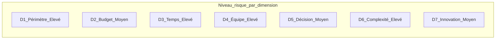
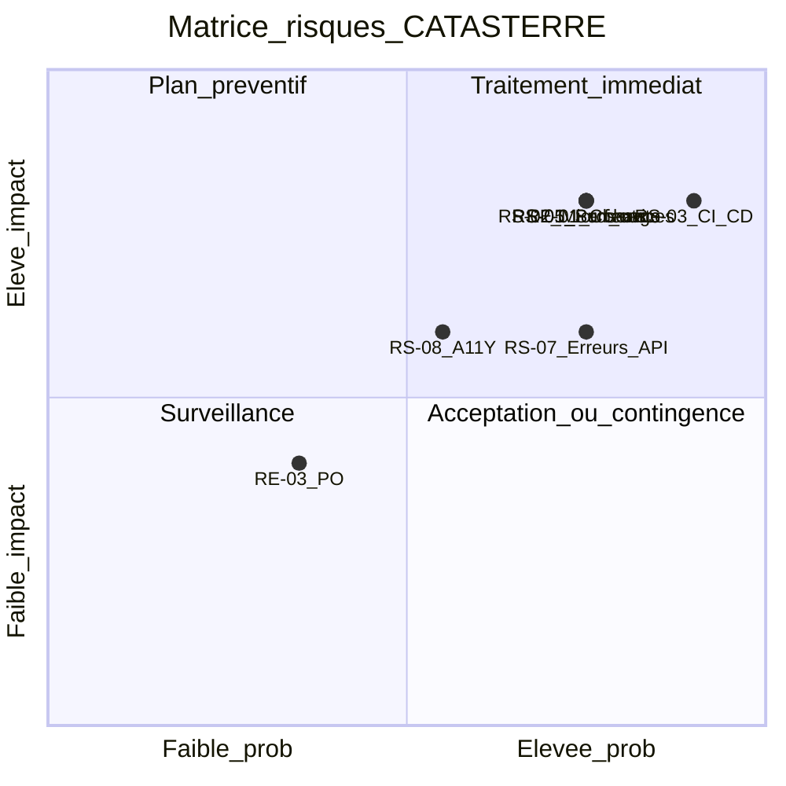

# Analyse des risques — Projet CATASTERRE

> Registre des risques génériques (spectre 7D) et spécifiques au projet, avec matrice de criticité et plan de prévention.

**Date :** juin 2026  
**Méthode :** [OpenClassrooms — Identifiez les risques d'un projet (spectre 7D)](https://openclassrooms.com/fr/courses/5774866-analysez-les-risques-de-votre-projet/6345421-identifiez-les-risques-d-un-projet)

**Documents de référence :** [projet.md](projet.md) · [backlog.md](backlog.md) · [veille.md](veille.md) · [formation.md](formation.md) · [GitHub Project Projet10 backlog](https://github.com/users/laurentcoufinal/projects/4)

---

## Contexte et méthodologie

### Contexte projet

CATASTERRE est une application **brownfield** (< 1 an) de visualisation de catastrophes naturelles via imagerie satellite. Les clients signalent des **lenteurs, erreurs et instabilités**. L'équipe de 4 personnes doit stabiliser l'UX, containeriser l'application, mettre en place CI/CD, puis envisager une architecture microservices — sur un backlog de **75 SP** répartis en ~5-6 sprints.

### Méthode d'analyse

1. **Spectre 7D** — identification systématique des risques génériques sur 7 dimensions (triangle CQD + humain + digital).
2. **Risques spécifiques** — complément interne/externe à partir du contexte CATASTERRE (SWOT, veille, backlog).
3. **Qualification** — pour chaque risque : origine, déclencheur, conséquences.
4. **Priorisation** — criticité = Probabilité (1-5) × Impact (1-5).
5. **Plan de prévention** — stratégies éviter / réduire / transférer / accepter, liées aux User Stories.

### Seuils de criticité

| Criticité (P×I) | Niveau | Réponse |
|-----------------|--------|---------|
| 1 à 6 | Faible | Surveillance passive |
| 8 à 9 | Moyen | Plan de contingence |
| 10 à 16 | Élevé | Actions préventives obligatoires |
| 20 à 25 | Critique | Traitement immédiat prioritaire |

### Ante-mortem recommandé

Une session **ante-mortem** en début de projet (« Ce projet est un échec retentissant — pourquoi ? ») avec l'équipe complète permettra de compléter ce registre. Les comités projet de fin de sprint ([projet.md](projet.md) L120-124) serviront de point de revue.

---

## 1. Analyse spectre 7D — risques génériques

Pour chaque dimension : constat CATASTERRE, niveau de risque estimé, risques identifiés.

### Synthèse radar par dimension

| Dim | Dimension | Niveau | Constat CATASTERRE |
|-----|-----------|--------|-------------------|
| D1 | Périmètre | **Élevé** | 11 US, 75 SP ; phase 2 microservices peu détaillée ; US luxueuses (9, 11) ; forks techniques non tranchés ([veille.md](veille.md)) |
| D2 | Budget | **Moyen** | ~42 480 € HT/mois (4 profils) ; cohérent avec ~5-6 sprints mais formation et dette brownfield peu budgétées |
| D3 | Temps | **Élevé** | Vélocité inconnue ; S1 = **12 SP** (ajusté) ; règle S2 = +2 à 4 SP ; capacité max 15 SP/sprint |
| D4 | Équipe | **Élevé** | Rachida seule sur DevOps + back Java ; Dimitry 3 ans ; Jorge UX non développeur |
| D5 | Prise de décision | **Moyen** | Questions ouvertes veille (OpenAPI, zoneless, bounded context) ; comités sprint prévus mais gouvernance PO non formalisée |
| D6 | Complexité | **Élevé** | Brownfield peu documenté ; stack Angular + Spring + MySQL ; données géospatiales ; sécurité Spring Security |
| D7 | Degré d'innovation | **Moyen** | Stack maîtrisée mais choix optionnels innovants (PMTiles, microservices, zoneless) sans références internes |

---

### D1 — Périmètre projet

**Questions types (réponses CATASTERRE) :**

| Question | Réponse | Signal |
|----------|---------|--------|
| Périmètre établi avec précision ? | Partiellement — backlog détaillé (39 tâches) mais architecture S4+ ouverte | Orange |
| Volume important ? | Oui — 75 SP, 2 phases (Docker puis microservices) | Rouge |
| Plusieurs domaines / réalisations ? | Oui — UX, DevOps, architecture, géospatial, export | Rouge |

**Risques génériques identifiés :**

| ID | Risque | Origine | Déclencheur | Conséquences | P | I | Crit. |
|----|--------|---------|-------------|--------------|---|---|-------|
| RG-01 | Dérive de périmètre | US luxueuses + forks veille non arbitrés | Ajout US-9/11 en S2-S3 sans ajustement capacité | Retard sur US haute priorité (1-5, 7) | 4 | 4 | **16** |
| RG-02 | Périmètre microservices flou | US-6 (13 SP) sans bounded contexts validés | Démarrage US-6 sans US6-T1/T2 | Extraction mal ciblée, surcoût, régression | 3 | 4 | **12** |

---

### D2 — Budget

**Questions types (réponses CATASTERRE) :**

| Question | Réponse | Signal |
|----------|---------|--------|
| Budget défini avec précision ? | Oui — TJM par profil, 42 480 € HT/mois | Vert |
| Budget inclut pilotage ? | Partiellement — Expert inclus mais formation non chiffrée | Orange |
| Cohérent avec charges identifiées ? | Globalement oui (~17 SP/sprint × 5 sprints) | Vert |
| Budget validé ? | Proposition commerciale en cours | Orange |

**Risques génériques identifiés :**

| ID | Risque | Origine | Déclencheur | Conséquences | P | I | Crit. |
|----|--------|---------|-------------|--------------|---|---|-------|
| RG-03 | Sous-estimation charges brownfield | Dette technique invisible au départ | Découverte dette JPA/géo en S2-S3 | Dépassement budget ou réduction périmètre | 4 | 3 | **12** |

---

### D3 — Temps

**Questions types (réponses CATASTERRE) :**

| Question | Réponse | Signal |
|----------|---------|--------|
| Planning prévisionnel établi ? | Oui — 5-6 sprints, S1 = 14 SP | Vert |
| Échéances impératives ? | Comités fin de sprint ; soutenance OC | Orange |
| Temps cohérent avec périmètre ? | Incertain — vélocité non mesurée | Rouge |
| Périodes sans travail ? | Non identifiées (congés non documentés) | Orange |

**Risques génériques identifiés :**

| ID | Risque | Origine | Déclencheur | Conséquences | P | I | Crit. |
|----|--------|---------|-------------|--------------|---|---|-------|
| RG-04 | Retard planning global | Vélocité réelle < 14 SP | S1 livre < 10 SP effectifs | Glissement US-7/8, report US-6 | 4 | 4 | **16** |
| RG-05 | Surengagement Sprint 2 | Règle +2 à 4 SP sans données S1 | Engagement 18 SP avec dette non résolue | Échec Sprint 2, baisse moral | 3 | 3 | **9** |

---

### D4 — Équipe

**Questions types (réponses CATASTERRE) :**

| Question | Réponse | Signal |
|----------|---------|--------|
| Compétences disponibles ? | Partiellement — géospatial et perf JPA à renforcer | Orange |
| Compétences en interne ? | Oui — pas de sous-traitance prévue | Vert |
| Ressources mobilisées ? | Oui — 4 × 40 h/semaine | Vert |
| Commanditaire compétent ? | Non évalué (hors périmètre équipe) | — |

**Risques génériques identifiés :**

| ID | Risque | Origine | Déclencheur | Conséquences | P | I | Crit. |
|----|--------|---------|-------------|--------------|---|---|-------|
| RG-06 | Surcharge Rachida | Seule sur Docker, CI, back, env test, microservices | US-5 + US-7 + US-8 en S1-S3 | Goulot, retard multi-US, burnout | 4 | 4 | **16** |
| RG-07 | Goulot compétences géo/perf | Données satellite + JPA non maîtrisés à fond | US-9 démarrée sans formation C/D | Résultats incorrects ou non livrables | 3 | 4 | **12** |

---

### D5 — Prise de décision

**Questions types (réponses CATASTERRE) :**

| Question | Réponse | Signal |
|----------|---------|--------|
| Gouvernance établie ? | Partiellement — Expert pilote, comités sprint | Orange |
| Décideurs disponibles ? | Comités fin sprint prévus | Vert |
| Décisionnaires identifiés ? | Expert + équipe ; PO non nommé | Orange |
| Chaîne de validation longue ? | Non — équipe réduite | Vert |

**Risques génériques identifiés :**

| ID | Risque | Origine | Déclencheur | Conséquences | P | I | Crit. |
|----|--------|---------|-------------|--------------|---|---|-------|
| RG-08 | Arbitrages techniques tardifs | 10+ questions ouvertes dans veille | Refinement S3 sans décision OpenAPI/geo | Rework, incohérence front/back | 3 | 3 | **9** |

---

### D6 — Complexité

**Questions types (réponses CATASTERRE) :**

| Question | Réponse | Signal |
|----------|---------|--------|
| Sécurité élevée ? | Oui — Spring Security, données immobilières | Orange |
| Systèmes externes ? | Imagerie satellite, potentiel AWS/k8s | Rouge |
| Complexité parcours/UX ? | Oui — carte, recherche, export | Rouge |
| Complexité technologique ? | Oui — brownfield + évolution architecture | Rouge |
| Environnement livraison maîtrisé ? | Non — pas de Docker ni env test actuellement | Rouge |

**Risques génériques identifiés :**

| ID | Risque | Origine | Déclencheur | Conséquences | P | I | Crit. |
|----|--------|---------|-------------|--------------|---|---|-------|
| RG-09 | Régressions sur parcours critiques | Code legacy non couvert par tests | Merge sans CI (US-7 non livrée) | Erreurs carte/auth en production | 5 | 4 | **20** |
| RG-10 | Dette legacy non cartographiée | Application < 1 an, peu documentée | Refactoring sans audit (US6-T1) | Fuite dette dans microservices | 4 | 4 | **16** |

---

### D7 — Degré d'innovation

**Questions types (réponses CATASTERRE) :**

| Question | Réponse | Signal |
|----------|---------|--------|
| Projet similaire déjà mené ? | Non — brownfield unique | Orange |
| Références identifiées ? | Oui — veille documentée | Vert |
| Documentation technologies ? | Oui — Angular, Spring, formats géo | Vert |
| Fonctionnalités innovantes ? | Choix optionnels (PMTiles, zoneless) | Orange |
| Étude de faisabilité ? | Partielle — veille juin 2026 | Orange |

**Risques génériques identifiés :**

| ID | Risque | Origine | Déclencheur | Conséquences | P | I | Crit. |
|----|--------|---------|-------------|--------------|---|---|-------|
| RG-11 | Courbe d'apprentissage technologies nouvelles | PMTiles, Strangler, zoneless non utilisés en interne | Activation scénarios F/B/H sans formation | Retard S4+, surcoût | 3 | 3 | **9** |

---

## 2. Risques spécifiques au projet

### Risques internes

| ID | Risque | Origine | Lien backlog / veille |
|----|--------|---------|----------------------|
| RS-01 | Lenteurs carte non résolues malgré corrections UX | GeoJSON massif (~350-500 Mo), perf front | US-9, US-1 ; veille §2.3 |
| RS-02 | Extraction microservices prématurée | Monolithe non modulaire, peu documenté | US-6 ; veille §1.1 |
| RS-03 | Absence CI/CD → régressions en production | Pas de pipeline d'intégration continue | US-7 ; [projet.md](projet.md) §1.3.3 |
| RS-04 | Dette JPA (N+1, OSIV) non traitée | Brownfield Spring Data Hibernate | US-9 ; veille §2.2 |
| RS-05 | Rachida goulot unique DevOps + back | Profil polyvalent sans relève identifiée | US-5, US-6, US-7, US-8 |
| RS-06 | Vélocité surestimée dès Sprint 2 | Règle +2 à 4 SP sans vélocité mesurée | backlog Sprint 1 |
| RS-07 | Erreurs front/back persistantes | Absence contrat API OpenAPI | US-2 ; veille §1.5 |
| RS-08 | Accessibilité non conforme | WCAG AA non atteint | US-3 ; [projet.md](projet.md) L40-41 |
| RS-09 | Containerisation incomplète | Docker S1 sans registry ni orchestration prod | US-5, US-7-T3 |
| RS-10 | Absence env test → parallel run impossible | Legacy et nouveau code sur même environnement | US-8 ; veille §3.1 |
| RS-11 | Lacune compétences tests automatisés | Équipe sans pratique JUnit/Cypress/TDD ; Expert seul sur pilotage | Daily Scrum S1 ; [comite-projet.md](comite-projet.md) |

### Risques externes

| ID | Risque | Origine | Lien projet |
|----|--------|---------|-------------|
| RE-01 | Insatisfaction clients / churn | Lenteurs, erreurs signalées | [projet.md](projet.md) §1.2 |
| RE-02 | Perte de compétitivité marché | Manque maintenance et évolution | §1.2 |
| RE-03 | Indisponibilité décideur / PO | Gouvernance produit non formalisée | Comités sprint |
| RE-04 | Évolution réglementaire accessibilité | Obligations légales (notaires, agences) | US-3 |
| RE-05 | Coûts cloud AWS imprévus | Scalabilité post-Docker, k8s | US-5, US-8 ; [projet.md](projet.md) L51-52 |
| RE-06 | Données satellite indisponibles ou dégradées | Dépendance fournisseur imagerie | Métier CATASTERRE |

---

## 3. Registre des risques qualifiés

Registre consolidé (génériques + spécifiques), format cause-effet.

### Risques critiques et élevés (priorité 1)

**RG-09 / RS-03 — Absence CI/CD, régressions en production**
- **Origine :** Application déployée sans pipeline ; tests manuels non systématisés.
- **Déclencheur :** Merge de code défectueux sur `main` sans quality gates.
- **Conséquences :** Régression parcours carte/auth ; erreurs clients amplifiées ; perte confiance.
- **P :** 5 · **I :** 4 · **Criticité :** 20 · **Propriétaire :** Rachida · **Statut :** Ouvert

**RG-01 / RS-01 — Performance carte insuffisante**
- **Origine :** Chargement GeoJSON massif côté client ; requêtes JPA non optimisées côté serveur.
- **Déclencheur :** Correction CSS/UX seule sans traitement données géo (US-1 sans US-9).
- **Conséquences :** Lenteurs persistantes ; clients insatisfaits ; objectif UX non atteint.
- **P :** 4 · **I :** 4 · **Criticité :** 16 · **Propriétaire :** Rachida + Dimitry · **Statut :** Ouvert

**RG-04 — Retard planning global**
- **Origine :** Vélocité équipe inconnue ; backlog 75 SP sur ~5-6 sprints optimiste.
- **Déclencheur :** Sprint 1 livre < 10 SP ; dette brownfield sous-estimée.
- **Conséquences :** Glissement US-7/8 ; report US-6 ; dépassement budget temps.
- **P :** 4 · **I :** 4 · **Criticité :** 16 · **Propriétaire :** Expert · **Statut :** Surveillé

**RG-06 / RS-05 — Surcharge Rachida**
- **Origine :** Rachida seule sur Docker, CI/CD, back Java, env test, microservices.
- **Déclencheur :** US-5 + US-7 + US-8 planifiées S1-S3 sans répartition.
- **Conséquences :** Goulot d'étranglement ; retard multi-US ; qualité back dégradée.
- **P :** 4 · **I :** 4 · **Criticité :** 16 · **Propriétaire :** Expert · **Statut :** Ouvert

**RG-10 / RS-02 — Extraction microservices prématurée**
- **Origine :** Monolithe non modulaire ; code peu documenté ; dette legacy.
- **Déclencheur :** Lancement US-6 sans US6-T1 (analyse bounded contexts) ni monolithe modulaire.
- **Conséquences :** Propagation dette ; services mal découpés ; downtime.
- **P :** 4 · **I :** 4 · **Criticité :** 16 · **Propriétaire :** Expert + Rachida · **Statut :** Ouvert

**RE-01 — Insatisfaction clients**
- **Origine :** Problèmes signalés avant projet d'évolution (lenteurs, erreurs, instabilités).
- **Déclencheur :** Quick wins S1 insuffisants (CSS sans perf carte).
- **Conséquences :** Churn clients ; perte parts de marché ; pression sur équipe.
- **P :** 4 · **I :** 4 · **Criticité :** 16 · **Propriétaire :** Expert · **Statut :** Ouvert

**RS-11 — Lacune compétences tests automatisés**
- **Origine :** Équipe sans pratique JUnit/Cypress/TDD ; Expert pilote le projet sans bande passante pour les tests.
- **Déclencheur :** DoD exige des tests auto mais personne ne peut les écrire au rythme du développement (Daily Scrum Rachida).
- **Conséquences :** Incrément S1 non validé automatiquement ; US7-T2 bloquée ; DoD contournée ou sprint bloqué.
- **P :** 4 · **I :** 4 · **Criticité :** 16 · **Propriétaire :** Expert + Rachida · **Statut :** Atténué (plan formation S2)

### Risques moyens (priorité 2)

**RG-02 — Périmètre microservices flou** · P:3 I:4 · Crit:12 · Expert · Ouvert  
**RG-03 — Sous-estimation budget brownfield** · P:4 I:3 · Crit:12 · Expert · Surveillé  
**RG-07 / RS-04 — Dette JPA** · P:3 I:4 · Crit:12 · Rachida · Ouvert  
**RS-07 — Erreurs front/back** · P:4 I:3 · Crit:12 · Dimitry + Rachida · Ouvert  
**RS-09 — Containerisation incomplète** · P:3 I:3 · Crit:9 · Rachida · Surveillé  
**RS-10 — Absence env test** · P:3 I:3 · Crit:9 · Rachida · Ouvert  
**RG-05 — Surengagement S2** · P:3 I:3 · Crit:9 · Expert · Surveillé  
**RG-08 — Arbitrages tardifs** · P:3 I:3 · Crit:9 · Expert · Ouvert  
**RG-11 — Courbe apprentissage** · P:3 I:3 · Crit:9 · Tous · Surveillé  
**RS-08 — Accessibilité** · P:3 I:3 · Crit:9 · Dimitry + Jorge · Ouvert  
**RS-11 — Lacune compétences tests** · P:4 I:4 · Crit:16 · Expert + Rachida · **Atténué**  
**RE-04 — Réglementation A11Y** · P:2 I:4 · Crit:8 · Jorge · Surveillé  
**RE-05 — Coûts AWS** · P:3 I:3 · Crit:9 · Rachida · Surveillé  

### Risques faibles (surveillance)

**RE-02 — Perte compétitivité** · P:2 I:3 · Crit:6 · Expert · Surveillé  
**RE-03 — Indisponibilité PO** · P:2 I:2 · Crit:4 · Expert · Surveillé  
**RE-06 — Données satellite** · P:2 I:3 · Crit:6 · Rachida · Surveillé  
**RS-06 — Vélocité surestimée** · couvert par RG-04/RG-05  

---

## 4. Matrice de criticité (P × I)

### Tableau priorisé (tri décroissant)

| Rang | ID | Risque | P | I | Criticité | Niveau |
|------|-----|--------|---|---|-----------|--------|
| 1 | RG-09 / RS-03 | Absence CI/CD → régressions | 5 | 4 | 20 | **Critique** |
| 2 | RG-01 / RS-01 | Performance carte insuffisante | 4 | 4 | 16 | **Élevé** |
| 3 | RG-04 | Retard planning global | 4 | 4 | 16 | **Élevé** |
| 4 | RG-06 / RS-05 | Surcharge Rachida | 4 | 4 | 16 | **Élevé** |
| 5 | RG-10 / RS-02 | Microservices prématurés | 4 | 4 | 16 | **Élevé** |
| 6 | RE-01 | Insatisfaction clients | 4 | 4 | 16 | **Élevé** |
| 7 | RS-11 | Lacune compétences tests | 4 | 4 | 16 | **Élevé** |
| 8 | RG-02 | Périmètre microservices flou | 3 | 4 | 12 | **Élevé** |
| 8 | RG-03 | Sous-estimation budget | 4 | 3 | 12 | **Élevé** |
| 9 | RG-07 / RS-04 | Dette JPA | 3 | 4 | 12 | **Élevé** |
| 10 | RS-07 | Erreurs front/back | 4 | 3 | 12 | **Élevé** |
| 11 | RG-05 | Surengagement S2 | 3 | 3 | 9 | Moyen |
| 12 | RG-08 | Arbitrages tardifs | 3 | 3 | 9 | Moyen |
| 13 | RG-11 | Courbe apprentissage | 3 | 3 | 9 | Moyen |
| 14 | RS-08 | Accessibilité | 3 | 3 | 9 | Moyen |
| 15 | RS-09 | Containerisation incomplète | 3 | 3 | 9 | Moyen |
| 16 | RS-10 | Absence env test | 3 | 3 | 9 | Moyen |
| 17 | RE-05 | Coûts AWS | 3 | 3 | 9 | Moyen |
| 18 | RE-04 | Réglementation A11Y | 2 | 4 | 8 | Moyen |
| 19 | RE-02 | Perte compétitivité | 2 | 3 | 6 | Faible |
| 20 | RE-06 | Données satellite | 2 | 3 | 6 | Faible |
| 21 | RE-03 | Indisponibilité PO | 2 | 2 | 4 | Faible |

### Quadrant de criticité

---

## 5. Plan de prévention

Pour chaque risque **Moyen, Élevé ou Critique** : stratégie et action concrète.

| ID | Niveau | Stratégie | Action | Responsable | Échéance | Lien backlog / formation |
|----|--------|-----------|--------|-------------|----------|--------------------------|
| RS-03 | Critique | Réduire | Mettre en place pipeline GitHub Actions avec lint + tests (US-7) | Rachida | Sprint 2 | US7-T1/T2 ; M6 |
| RS-01 | Élevé | Réduire | Profiler format données geo avant optimisation ; ne pas traiter US-1 seule comme fix perf | Rachida + Dimitry | S4+ / anticipation S2 | US9-T1 ; veille §2.3 |
| RG-04 | Élevé | Réduire | Mesurer vélocité S1 réelle ; ajuster engagement S2 (+2 SP max si < 12 SP livrés) | Expert | Fin S1 | backlog règle S2 |
| RS-05 | Élevé | Réduire | Pair programming Dimitry sur US2-T3 ; documenter procédures Docker/CI pour autonomie | Expert | S1-S2 | US2-T3 ; M5/M6 |
| RS-02 | Élevé | Éviter | Imposer monolithe modulaire (scénario A) avant US-6 ; atelier bounded contexts | Expert | Pré-S4 | US6-T1 ; A-EX1 |
| RE-01 | Élevé | Réduire | Quick wins S1 démontrables en Sprint Review (CSS + erreurs + Docker local) | Tous | Fin S1 | US-1, US-2, US-5 |
| RG-02 | Élevé | Réduire | Rédiger document architecture cible US6-T2 avant toute extraction | Expert | S4 | US6-T2 |
| RG-03 | Élevé | Réduire | Intégrer 0,5j/sprint formation time dans capacité ; suivre modules [formation.md](formation.md) | Expert | S1-S3 | formation socle |
| RS-04 | Élevé | Réduire | Audit Hibernate : requêtes/endpoint avant cache (US9-T1) | Rachida | S4+ | US9-T1 ; C-RA1 |
| RS-07 | Élevé | Réduire | Introduire OpenAPI si comité valide scénario G ; composant erreur unifié US-2 | Rachida + Dimitry | S2 | US-2 ; G-RA1 |
| RS-08 | Moyen | Réduire | Audit Jorge S2 + corrections WCAG AA S2 | Jorge + Dimitry | Sprint 2 | US-3 ; M9 |
| RS-10 | Moyen | Réduire | Provisionner env test isolé (US-8) ; parallel run legacy/nouveau | Rachida | Sprint 3 | US8-T1 ; M8 |
| RG-05 | Moyen | Accepter | Plafonner S2 à vélocité S1 + 2 SP (pas +4) si dette non résolue | Expert | Refinement S2 | backlog |
| RG-08 | Moyen | Réduire | Trancher 3 questions veille par comité projet | Expert | Chaque sprint | veille §fin |
| RG-11 | Moyen | Réduire | Activer modules formation conditionnels avant choix technique | Expert | S3-S4 | formation A-H |
| RS-09 | Moyen | Réduire | Publier image Docker en registry à chaque merge (US7-T3) | Rachida | Sprint 2 | US7-T3 |
| RE-04 | Moyen | Réduire | Conformité WCAG AA sur parcours critiques (US-3) | Jorge | Sprint 2 | US3-T1/T4 |
| RE-05 | Moyen | Transférer | Estimation coûts AWS avant provisionnement ; profils Spring externalisés | Rachida | Sprint 3 | US8-T2 |
| RS-11 | Élevé | Réduire | Plan formation tests T-DI1/T-RA1/T-ALL1 ; Expert facilitateur pas seul testeur | Expert + Rachida | S2 | [formation.md](formation.md), [comite-projet.md](comite-projet.md) |

### Ante-mortem — risques additionnels à explorer

Lors de la session ante-mortem avec l'équipe, vérifier notamment :
- Congés / indisponibilités non planifiées (D3)
- Qualité des données satellite sources (RE-06)
- Résistance au changement côté clients pendant migration microservices
- Secrets / credentials en dur dans le code legacy

---

## 6. Suivi et gouvernance

### Fréquence de revue

| Moment | Action | Participants |
|--------|--------|--------------|
| **Début projet** | Ante-mortem — compléter registre | Tous |
| **Fin de sprint** | Comité projet — revue top 5 risques, mise à jour statuts | Expert + équipe |
| **Rétrospective** | 1 risque materialisé ou évité à documenter | Tous |
| **Refinement** | Vérifier impact nouvelles US sur registre | Expert |

### Indicateurs de suivi (reprise [veille.md](veille.md) §3.3)

| Indicateur | Seuil d'alerte | Risque lié |
|------------|----------------|------------|
| Ratio bugs récurrents / features | > 50 % par sprint | RS-03, RE-01 |
| Couverture tests | Stagnation 2 sprints | RS-03 |
| Temps build/deploy | > 15 min sans amélioration | RS-05 |
| Requêtes SQL / endpoint critique | > 20 sans audit | RS-04 |
| Vélocité mesurée vs engagement | Écart > 30 % | RG-04 |
| Modules formation Certified | 0 en fin S2 | RG-11 |

### Mise à jour du registre

Le registre sera révisé lorsque le comité projet tranche :
- OpenAPI (scénario G) · Zoneless (scénario H)
- Premier bounded context (C ou D) · Format géo (E ou F)
- Prérequis monolithe modulaire (A) avant microservices (B)

---

## Liens avec le backlog, la veille et la formation

| Document | Rôle dans la gestion des risques |
|----------|----------------------------------|
| [backlog.md](backlog.md) | User Stories = actions de mitigation (US-5 à US-8 prioritaires) |
| [veille.md](veille.md) | Questions ouvertes = risques D5 ; perf géo = RS-01 |
| [formation.md](formation.md) | Montée en compétence = mitigation RG-06, RG-07, RG-11 |
| [GitHub Project](https://github.com/users/laurentcoufinal/projects/4) | Suivi opérationnel issues #2-#51 |

### Synthèse pour la proposition commerciale (section 2.4)

| Niveau | Nombre | Risques clés |
|--------|--------|--------------|
| Critique | 1 | RS-03 (CI/CD) |
| Élevé | 10 | RS-01, RS-02, RS-05, RE-01, RG-04, RG-10, RG-02, RG-03, RS-04, **RS-11** |
| Moyen | 8 | RS-07, RS-08, RS-09, RS-10, RG-05, RG-08, RG-11, RE-04/05 |
| Faible | 3 | RE-02, RE-03, RE-06 |

**Message clé :** les risques les plus critiques sont **traitables dès Sprint 1-2** via US-5 (Docker), US-7 (CI/CD), US-2 (erreurs) et le **plan formation tests** (RS-11) — sans attendre la phase microservices.

### Lien avec les solutions

Voir [choix.md](choix.md) — chaque solution (pragmatique, structurée, cloud-native) traite un sous-ensemble différent de ce registre.

### Comité projet

Voir [comite-projet.md](comite-projet.md) — point bloquant tests (RS-11), adaptation Sprint 1 et plan d'action.

---

*Document rédigé le 13/06/2026 dans le cadre du Projet 10 — CATASTERRE (OpenClassrooms).*
