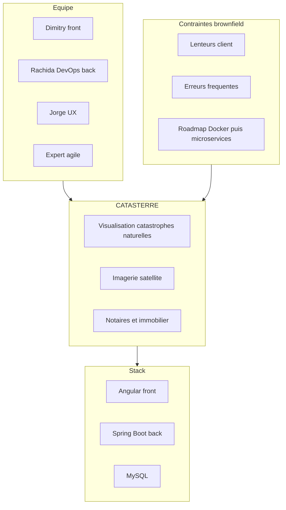
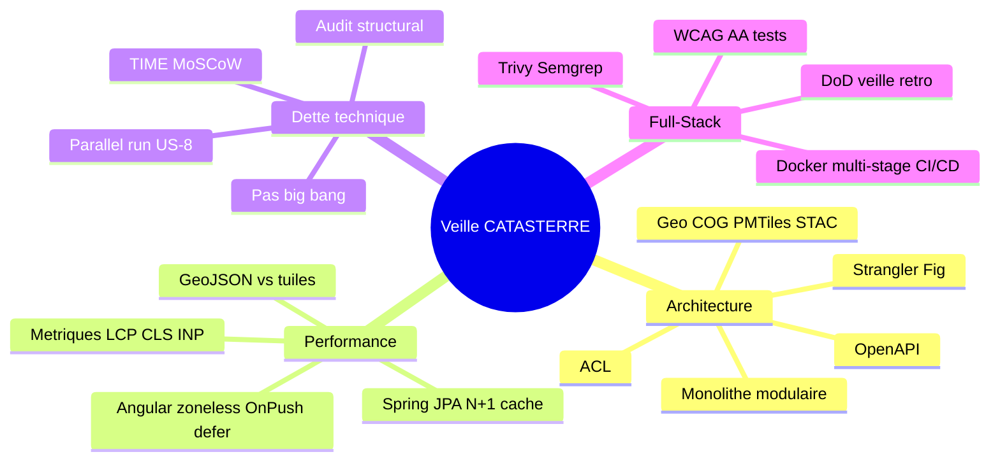
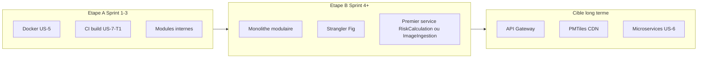
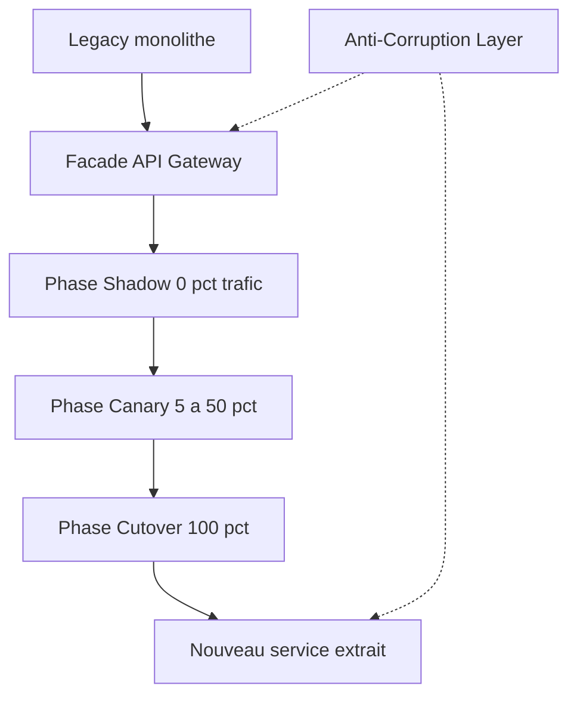
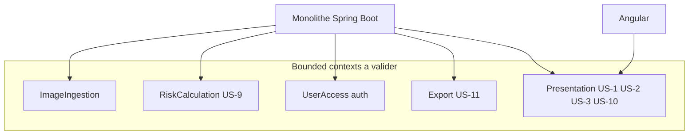
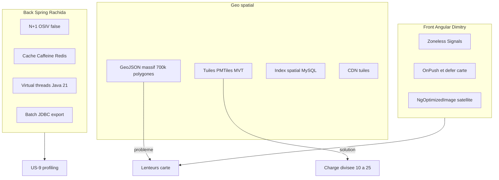
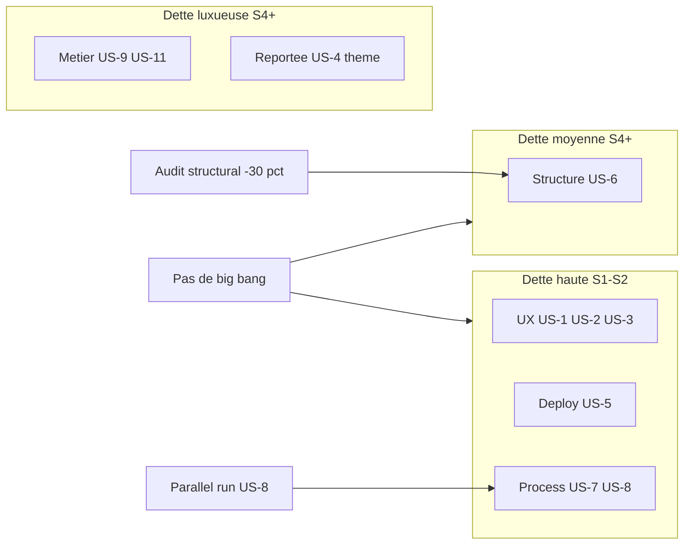
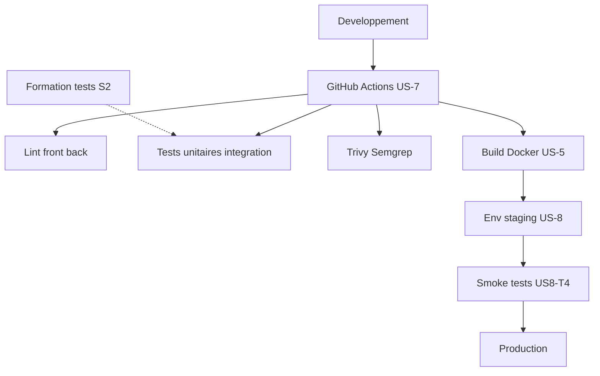
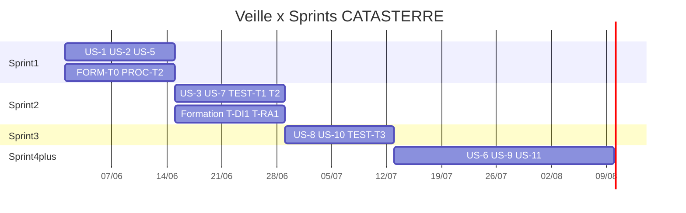

# Veille technologique CATASTERRE — Présentation Mermaid

> Résumé de [veille.md](../veille.md) · juin 2026 · Export OpenOffice

## Export OpenOffice

| Méthode | Fichier | Action |
|---------|---------|--------|
| **Writer / Impress** | `veille-openoffice.html` | Fichier → Ouvrir dans LibreOffice/OpenOffice → Enregistrer sous `.odt` ou `.odp` |
| **Images vectorielles** | `svg/*.svg` | Insertion → Image → choisir chaque SVG (10 diagrammes) |
| **Source Mermaid** | `diagrams/*.mmd` | Éditer et régénérer via `scripts/generate-veille-mermaid.sh` |
| **Markdown** | Ce fichier | Copier les blocs ```mermaid dans un outil compatible |

---

## 1. Contexte projet



| Dimension | Constat |
|-----------|---------|
| Maturité | Brownfield < 1 an |
| Stack | Angular · Spring Boot · MySQL |
| Roadmap | Docker → microservices |
| Backlog | 11 US · 75 SP |

---

## 2. Quatre axes de veille



---

## 3. Architecture — Roadmap



### Strangler Fig



### Bounded contexts



---

## 4. Performance



| Métrique | Seuil indicatif |
|----------|-----------------|
| LCP | ≤ 2,5 s |
| CLS | ≤ 0,1 |
| INP | ≤ 200 ms |

---

## 5. Dette technique



---

## 6. Full-Stack DevOps



---

## 7. Veille × Sprints



---

## 8. Matrice User Stories × axes

| US | Titre | Architecture | Performance | Dette | Full-Stack |
|----|-------|-------------|-------------|-------|------------|
| US-1 | Style CSS | — | OnPush, NgOptimizedImage | Dette UX | Lint, revue Jorge |
| US-2 | Messages erreur | Contrat API | — | Dette UX | Composant + mapping |
| US-3 | Accessibilité | — | — | Dette UX | WCAG AA |
| US-5 | Docker | Conteneurisation | — | Dette deploy | Multi-stage |
| US-6 | Microservices | Strangler, ACL | — | Dette structurelle | OpenAPI |
| US-7 | CI/CD | — | Anti-régression | Dette process | GH Actions, scans |
| US-8 | Env. test | — | — | Parallel run | Smoke tests |
| US-9 | Risque inondation | RiskCalculation | JPA, tuiles | — | Profiling |
| US-10 | Compatibilité | — | @defer | — | Matrice navigateurs |
| US-11 | Export | Export | Batch JDBC | Luxueuse | API + UI |

---

## Questions comité

1. Audit code + perf + données géo avant Sprint 3 ?
2. Monolithe modulaire prérequis explicite avant US-6 ?
3. Indicateurs dette suivis en rétrospective ?

---

*Source : veille.md · Projet 10 CATASTERRE · juin 2026*
